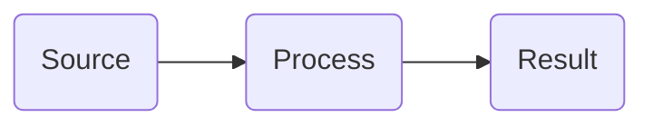

# Payerbox Documentation

This is a documentation repository for Payerbox. It uses Health Samurai's `docs-tools` for linting and image optimization.

All documentation is written in **English**.

## Structure

```
docs/           — markdown files (documentation pages)
assets/         — images and downloadable files
SUMMARY.md      — table of contents and navigation
docs-lint.yaml  — linter configuration
redirects.yaml  — URL redirects
```

## Source code (agent reference only — DO NOT link from docs)

Payerbox ships as three components. Read these repos to verify implementation behavior, parameter names, error codes, and supported flags. **Never link to them in published documentation** — they are private.

| Component | Source repo (private) | Public Docker image (OK to link) |
|---|---|---|
| FHIR App Portal + Developer Portal | https://github.com/HealthSamurai/smartbox | https://hub.docker.com/r/healthsamurai/fhir-app-portal |
| Interop APIs (Patient / Provider / Payer-to-Payer / Directory) | https://github.com/HealthSamurai/interop | https://hub.docker.com/r/healthsamurai/interop |
| Prior Auth (CRD / DTR / PAS) | https://github.com/HealthSamurai/prior-auth | https://hub.docker.com/r/healthsamurai/prior-auth |

If a doc needs to point users at the running software, link the Docker Hub image — never the GitHub repo.

## Aidbox documentation (style and platform reference)

Payerbox runs on Aidbox. The Aidbox docs repo is public: https://github.com/HealthSamurai/aidbox-docs (rendered at `docs.aidbox.app`).

Read it when you need:
- Style/structure patterns for a topic Aidbox already documents (auth, FHIR storage, SearchParameters, SMART on FHIR, etc.)
- Source-of-truth for Aidbox features Payerbox inherits

Do not hyperlink to `docs.aidbox.app` — the `absolute-links` lint blocks it. If you must reference Aidbox docs, mention them in plain text ("see Aidbox docs on …") rather than as a markdown link.

## Page types: Pillar vs Reference

Docs split into two page types — keep them distinct.

**Reference** — `docs/api-reference/operations/*`. For integrators writing code against an endpoint.

Must include:
- H1 = operation name, plain text, no backticks (e.g. `# $op-name`)
- Intro: IG name, pinned STU version, what the operation does
- Endpoints (URL paths)
- Auth: 1–3 lines + cross-link to `api-reference/authentication.md`
- Input/Output Parameters — full tables (cardinality, types, descriptions)
- Examples — all Request/Response variants including errors and edge cases (JSON payloads)
- Errors table
- Current Limitations — full
- At least one outgoing link (usually cross-link to the pillar)

Must not include:
- Marketing language ("powerful", "seamless", "in action")
- Regulatory framing (lives in `compliance/*`)
- Authentication onboarding flow (lives in `authentication.md`)
- Path-choice comparisons ("X vs Y")

**Pillar** — `docs/interop-apis/*`, `docs/prior-auth/*`. For architects/PMs/devs choosing and understanding an API before integration.

Must include:
- H1 = human name of the API (no backticks, no `$op-name`)
- Overview: what it is, who uses it, how it fits the stack (e.g. CRD → DTR → PAS)
- Architectural / sequence diagram if helpful
- Path-choice table when alternatives exist (e.g. DTR SMART App vs `$questionnaire-package`)
- Lifecycle / flow overview
- For each key flow step: one Request+Response pair in ``, JSON payloads, ≤30 lines each — to convey shape, not depth
- Current Limitations — short, only what affects path choice (full version stays in reference)
- Cross-links to every reference page for the API + to `compliance/*`

Must not include:
- Backticked operation name in H1
- Full Parameters tables (lives in reference)
- All Response variants or error codes (lives in reference)
- Authentication onboarding flow (lives in `authentication.md`)
- Regulatory anchor tables — CFR citations, compliance dates, response-time SLAs, member-education timelines. In the page's opening paragraph (right after the H1) hyperlink the rule name to its `compliance/*` page and state the compliance deadline. No second clause describing what lives in compliance ("full regulatory detail …", "for CFR citations see …") — the hyperlink is the link.

External systems referenced from a pillar (e.g. CRD's Decision Service via `CDS_DECISION_SERVICE_URL`) stay in the pillar — they explain architecture, not the endpoint contract.

`docs/compliance/*` is neither pillar nor reference — regulatory citation only, with CFR/CMS anchors and links to relevant pillar/reference pages.

## Writing Documentation

### Setup

Run `bun install` once after cloning — this installs docs-tools and sets up git hooks.

`docs-tools` is intentionally unpinned (`github:HealthSamurai/docs-tools`). `bun install` installs the version locked in `bun.lock` without modifying it. CI runs `bun update docs-tools` to pull the latest version and commits the updated `bun.lock` back to the repo.

### Creating a New Page

1. Create a `.md` file in `docs/` (or a subdirectory)
2. Start the file with a single `# Title` heading
3. Add the page to `SUMMARY.md` in the correct section
4. Run `bun lint` to verify everything is correct

### Frontmatter (optional)

Pages can have YAML frontmatter:

```markdown
---
hidden: true
description: Page description for SEO
---
# Page Title
```

- `hidden: true` — page is excluded from orphan-pages lint check

### SUMMARY.md Format

```markdown
# Table of contents

## Section Name

* [Page Title](page-file.md)
* [Another Page](subdir/page.md)
```

Rules:
- Page title in SUMMARY.md must match the `# H1` heading in the file
- Use "and" instead of "&" in titles
- Every `.md` file in `docs/` must be listed in SUMMARY.md

### Images

Place images in `assets/` directory (use subdirectories to organize, e.g. `assets/get-started/`).

```markdown

```

- Always provide meaningful alt text — linter warns on empty ``
- Supported formats: PNG, JPG, JPEG, GIF, SVG, WebP, AVIF
- CI automatically converts images to AVIF and updates references — commit as PNG/JPG, optimization happens on push
- To optimize locally before pushing: `bun images:optimize`

### Mermaid Diagrams

Mermaid diagrams are supported via ` ```mermaid ` code blocks. They are rendered server-side to SVG (light + dark themes). Use round rectangles `(Node Name)` instead of `[Node Name]` for nodes. No custom CSS classes or inline styles — only the built-in color classes below.

#### Color Classes

Apply colors to nodes using `class NodeName color` or inline `:::color` syntax. The class name is `{color}{width}` where width is the border thickness in pixels (1, 2, or 3).

Available colors: `red`, `blue`, `violet`, `green`, `yellow`, `neutral`

Examples: `red1`, `blue2`, `green3`, `neutral1`



Class definitions are auto-injected — do not write `classDef` lines manually.

### Markdown Rules

- Exactly one `# H1` per file (the page title)
- Do not skip heading levels (H1 → H3 is wrong, use H1 → H2 → H3)
- No empty headings
- All internal links must point to existing files
- All referenced images must exist in `assets/`
- Images should have meaningful alt text
- ALWAYS use proper language in codeblocks.

### Redirects

When renaming or moving a page, add a redirect in `redirects.yaml` so old URLs keep working:

```yaml
redirects:
  old/path/slug: new/path/to/page.md
  another/old/slug: some/page.md#section-anchor
```

- **Keys** — old URL slugs (no leading `/`, no `.md` extension)
- **Values** — relative paths to `.md` files in `docs/` directory
- Section anchors are supported: `page.md#section` redirects to a specific section
- The linter checks that target `.md` files exist — missing targets cause an error

## Supported Widgets

Widgets fall into two shapes:

- **Block widgets** — require an opening and closing tag (` … `). All widgets below are block widgets except `embed` and `file`.
- **Self-closing widgets** — one tag with a trailing slash: ``, ``. `file` also supports a block form when you need custom link text.

Nesting:
- `` must be inside ``
- `` must be inside ``
- ``, ``, `` must be inside ``
- Other widgets nest freely (e.g. hints inside tabs, code blocks inside steps).

### Hint (callout box)

```markdown

Informational message.

```

Styles: `info`, `success`, `warning`, `danger`

### Tabs

`` must be inside ``.

```markdown


Content for tab 1.


Content for tab 2.


```

### Stepper (numbered steps)

`` must be inside ``.

```markdown


First step content.


Second step content.


```

### Code Block with Title

```markdown

```yaml
key: value
```

```

### Embed (YouTube or link card)

```markdown



```

### Content Reference (link card to another page)

```markdown

[Page Title](path/to/page.md)

```

### File Download

```markdown



Download Archive

```

### Carousel (image slideshow)

```markdown




```

### Quote (testimonial)

```markdown

Quote text here.

```

## Available Commands

```
bun lint          — fix lint issues automatically
bun lint:check    — check for issues without fixing
bun images:check  — find unoptimized images
bun images:optimize — convert images to AVIF format
```

## Git Workflow

- Commit directly to `main` branch
- After committing, ask the user before pushing
- Before starting work and before pushing, always pull with rebase: `git pull --rebase`

### Pre-push Checks

A pre-push git hook runs `bun lint` automatically before every push. If lint fails, the push is blocked.

**Before pushing, always run `bun lint` yourself first.** If there are errors:
1. Show the user what failed
2. Fix the issues (most are auto-fixable by `bun lint` without `--check`)
3. Commit the fixes
4. Only then push

Common lint errors and how to fix them:
- **summary-sync** — file exists but not in SUMMARY.md (or vice versa). Add/remove the entry.
- **title-mismatch** — H1 in file differs from title in SUMMARY.md. Make them match.
- **broken-links** — internal link points to non-existent file. Fix the path.
- **missing-images** — referenced image not found in `assets/`. Add the image or fix the path.
- **h1-headers** — more than one `# H1` in a file. Keep only one.
- **empty-headers** — heading with no text (`## `). Add text or remove.
- **heading-order** — skipped heading level (e.g. H1 → H3). Add the missing level.
- **unparsed-widgets** — unclosed or mismatched widget tags. Close `` with ``, etc.
- **broken-references** — leftover GitBook `broken-reference` placeholder. Replace with real link.
- **image-alt** (warning) — image without alt text. Add ``.
- **deprecated-links** — link points to a page in a deprecated directory. Update to current page.
- **absolute-links** — hardcoded absolute URL to our own docs (`docs.aidbox.app` or `www.health-samurai.io/docs`). Replace with a relative path (`../section/page.md`).
- **dead-end-pages** (warning) — page has no outgoing links to other docs. Add at least one cross-link to a related page. Exempt: `SUMMARY.md`, `README.md` files, and pages under `deprecated/`.

CI automatically optimizes images on push.
