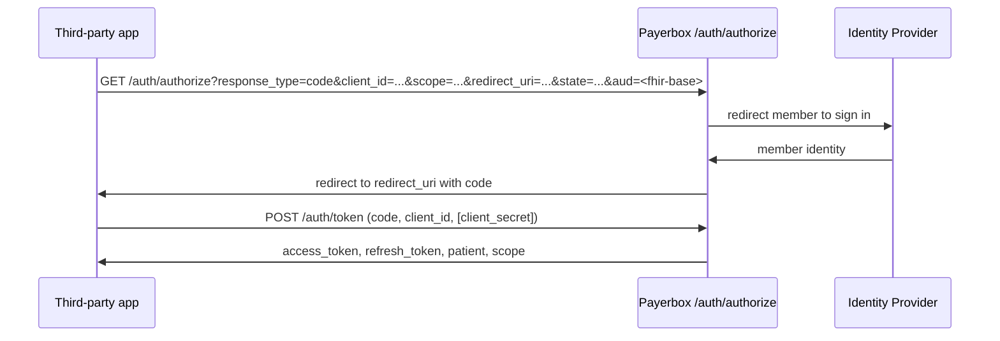
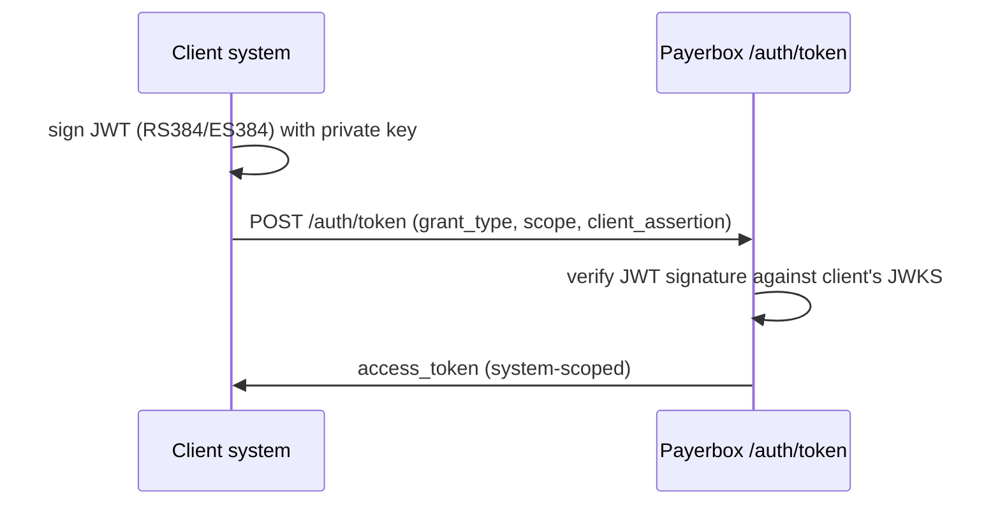

# Authentication

Payerbox supports two SMART on FHIR authentication flows:

- **SMART App Launch** — member-authorized OAuth 2.0 for third-party apps reading a single member's data (Patient Access)
- **SMART Backend Services** — system-to-system asymmetric JWT for Provider Access, Payer-to-Payer, PAS

Both are defined in the [HL7 SMART App Launch IG 2.2.0](https://hl7.org/fhir/smart-app-launch/STU2.2/).

## Endpoint discovery

The SMART configuration document advertises all endpoints. Fetch it before configuring a client:

```bash
GET <base>/.well-known/smart-configuration
```

Returns issuer, authorization endpoint, token endpoint, JWKS URL, supported scopes, supported response types, and SMART capabilities.

| Endpoint | Used by |
|---|---|
| `<base>/auth/authorize` | SMART App Launch — authorization redirect |
| `<base>/auth/token` | Both flows — token exchange |
| `<base>/fhir/.well-known/jwks.json` | Backend Services — clients use this to fetch the server's public keys; clients also publish their own JWKS for the server to verify their signed JWTs |
| `<base>/fhir/metadata` | CapabilityStatement (per API surface) |

## SMART App Launch (member-authorized)

Used by third-party apps in the [FHIR App Portal](../fhir-app-portal/README.md). Member discovers an app in the [Smart App Gallery](../fhir-app-portal/smart-app-gallery.md), clicks Launch, signs in, and grants the scopes the app requested.

### Standalone launch



### EHR launch

The EHR initiates the launch by redirecting to the app with a `launch` token; the app then completes the OAuth dance using the same endpoints. See the [SMART App Launch — EHR Launch](https://hl7.org/fhir/smart-app-launch/STU2.2/app-launch.html#launch-app-ehr-launch) section.

### Required parameters

| Parameter | Value |
|---|---|
| `response_type` | `code` |
| `client_id` | Issued by the [Developer Portal](../fhir-app-portal/developer-portal.md) |
| `redirect_uri` | Registered with the app |
| `scope` | Space-separated SMART scopes; must include `launch/patient` for standalone or `launch` for EHR launch, plus `openid fhirUser` for identity |
| `aud` | The FHIR base URL the app intends to call |
| `state` | CSRF nonce |
| `code_challenge` + `code_challenge_method=S256` | Required for public apps (PKCE) |

### Confidential vs public apps

| Type | Token exchange | Client Secret |
|---|---|---|
| Confidential | `client_secret_basic` or `client_secret_post` | Issued at app registration |
| Public | PKCE required | Not used |

## SMART Backend Services (system-to-system)

Used by Provider Access, Payer-to-Payer, and PAS. The client signs a JWT with its private key; Payerbox verifies it against the client's JWKS endpoint registered at onboarding.

### Onboarding flow

Before a client can request tokens, the payer admin registers it.

1. **Partner** provides its JWKS to the payer — either by reference (a `jwks_uri` URL the payer fetches) or by value (inline JWKS supplied at registration). Per [SMART Backend Services — Registering a SMART Backend Service](https://hl7.org/fhir/smart-app-launch/STU2.2/backend-services.html#registering-a-smart-backend-service).
2. **Payer admin** creates a Client resource in Aidbox referencing the partner's JWKS (`jwks_uri` or inline `jwks`), the allowed scopes (e.g. `system/Claim.cu system/ClaimResponse.r` for PAS, `system/*.read` for Provider Access), and access policies. See [Aidbox Application/Client Management](https://www.health-samurai.io/docs/aidbox/access-control/identity-management/application-client-management).
3. **Payer admin** returns the Client ID to the partner. For confidential clients without JWKS, a Client Secret is also issued.
4. **Partner** signs a JWT assertion with its private key and exchanges it at `<base>/auth/token` (see Token request below). OAuth 2.0 Client Credentials with Client ID + Secret is accepted for internal integrations as a fallback.

### Token request



```bash
POST <base>/auth/token
Content-Type: application/x-www-form-urlencoded

grant_type=client_credentials
&scope=system/Patient.read+system/ExplanationOfBenefit.read
&client_assertion_type=urn:ietf:params:oauth:client-assertion-type:jwt-bearer
&client_assertion=<signed-JWT>
```

### Client assertion JWT

| Claim | Value |
|---|---|
| `iss` | Client's Client ID |
| `sub` | Same as `iss` |
| `aud` | Payerbox token endpoint URL |
| `exp` | Now + 5 minutes (max) |
| `jti` | Unique nonce |
| Signature | RS384 or ES384 (RS256 not allowed per spec) |

### Client JWKS

At onboarding, the client registers a JWKS URL (preferred) or pre-shared public keys with the payer. Payerbox fetches the JWKS to verify client assertions. Key rotation: clients update their JWKS endpoint; Payerbox refreshes the cached keys per the `Cache-Control` header.

## Scopes

SMART v2 scopes follow the format `<context>/<resource>.<permissions>`:

| Context | Use |
|---|---|
| `patient/` | Member-scoped (SMART App Launch). The access token's `patient` claim identifies which member. |
| `system/` | System-level (Backend Services). No per-member filter; access governed by attribution and consent. |
| `user/` | User-scoped (rare; used when a logged-in clinician launches an app). |

Permissions in v2: `c` (create), `r` (read), `u` (update), `d` (delete), `s` (search). Wildcards: `*` for any.

### Common scope sets

| Surface | Recommended scopes |
|---|---|
| Patient Access app (read-only) | `openid fhirUser patient/*.read offline_access` |
| Provider Access (Backend Services) | `system/*.read` |
| Payer-to-Payer (Backend Services) | `system/*.read` |
| PAS (Backend Services) | `system/Claim.cu system/ClaimResponse.r` |

Full scope inventory exposed by Payerbox: see `<base>/.well-known/smart-configuration` `scopes_supported`.

## Common errors

| HTTP | OAuth error | Cause |
|---|---|---|
| 400 | `invalid_request` | Missing required parameter |
| 400 | `invalid_grant` | Authorization code expired, already used, or refresh token invalid |
| 400 | `invalid_client` | Client ID unknown or client assertion signature invalid |
| 400 | `invalid_scope` | Requested scope not allowed for this client |
| 401 | `invalid_token` | Access token expired or revoked |
| 403 | `insufficient_scope` | Token lacks required scope for the resource |

