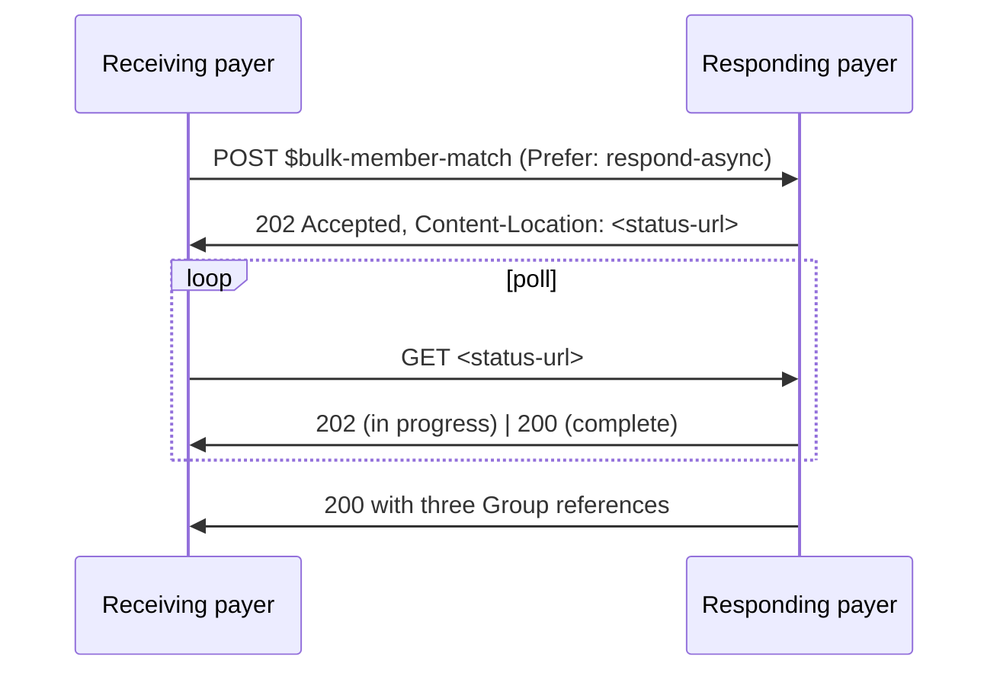

# $bulk-member-match

Operation defined by the [Da Vinci PDex IG](https://hl7.org/fhir/us/davinci-pdex/) for **Payer-to-Payer** member matching. The receiving payer submits a list of new members with demographics and prior coverage references; the responding (former) payer matches and returns three Group resources.

Supports both **synchronous** and **asynchronous** modes.

## Endpoint

```
POST <base>/fhir/$bulk-member-match
```

## Auth

SMART Backend Services. Scope: `system/Group.cu system/Patient.r`. Receiving and responding payers exchange JWKS at onboarding.

See [Authentication](../authentication.md).

## Request

A FHIR Parameters bundle with one entry per member.

```http
POST <base>/fhir/$bulk-member-match
Authorization: Bearer <access-token>
Content-Type: application/fhir+json
Prefer: respond-async      # optional; sync is the default
```

```json
{
  "resourceType": "Parameters",
  "parameter": [
    {
      "name": "MemberPatient",
      "resource": {
        "resourceType": "Patient",
        "identifier": [{ "system": "http://hl7.org/fhir/sid/us-mbi", "value": "1A23B45C67D8" }],
        "name": [{ "family": "Smith", "given": ["John"] }],
        "birthDate": "1970-04-15",
        "gender": "male"
      }
    },
    {
      "name": "CoverageToMatch",
      "resource": {
        "resourceType": "Coverage",
        "status": "active",
        "subscriberId": "1A23B45C67D8",
        "payor": [{ "identifier": { "value": "REQUESTING-PAYER-ID" } }],
        "period": { "start": "2026-01-01" }
      }
    },
    {
      "name": "Consent",
      "resource": {
        "resourceType": "Consent",
        "status": "active",
        "scope": { "coding": [{ "code": "patient-privacy" }] },
        "category": [{ "coding": [{ "code": "IDSCL" }] }],
        "patient": { "reference": "Patient/<requesting-payer-member-id>" }
      }
    }
  ]
}
```

The request can carry many members. Each member contributes one (MemberPatient, CoverageToMatch, Consent) triplet.

| Parameter | Cardinality | Description |
|---|---|---|
| `MemberPatient` | 1..* | One per member |
| `CoverageToMatch` | 0..1 per member | Active coverage from the receiving payer |
| `Consent` | 1..1 per member | Member's opt-in consent record (CMS-0057-F requires opt-in for P2P) |

## Sync mode

The default. Server returns the three Groups in the response body.

```http
HTTP/1.1 200 OK
Content-Type: application/fhir+json
```

```json
{
  "resourceType": "Parameters",
  "parameter": [
    {
      "name": "MatchedMembers",
      "valueReference": { "reference": "Group/matched-<uuid>" }
    },
    {
      "name": "NonMatchedMembers",
      "valueReference": { "reference": "Group/non-matched-<uuid>" }
    },
    {
      "name": "ConsentConstrainedMembers",
      "valueReference": { "reference": "Group/consent-constrained-<uuid>" }
    }
  ]
}
```

Recommended for batches under a few hundred members.

## Async mode

For larger batches. Include `Prefer: respond-async`.



```http
HTTP/1.1 202 Accepted
Content-Location: <base>/fhir/$bulk-member-match/<job-id>/status
```

Poll the status URL until 200. The completion response is the same Parameters payload as sync mode.

## The three Groups

All three conform to `PDexMemberMatchGroup` profile.

| Group | Members included |
|---|---|
| `MatchedMembers` | Confirmed matches with valid consent. Use as input to `$davinci-data-export?exportType=payertopayer`. |
| `NonMatchedMembers` | No match found in the responding payer's records. |
| `ConsentConstrainedMembers` | Matched, but consent prevents data sharing (revoked, expired, or never granted). |

`Group.characteristic` carries the requesting payer reference and a timestamp.

## Next step

For each member in `MatchedMembers`, the receiving payer calls `$davinci-data-export` with `exportType=payertopayer` on that Group:

```bash
POST <base>/fhir/Group/matched-<uuid>/$davinci-data-export?exportType=payertopayer
Authorization: Bearer <access-token>
Prefer: respond-async
```

See [`$davinci-data-export`](davinci-data-export.md).

## Errors

| HTTP | Cause |
|---|---|
| 400 | Malformed Parameters payload |
| 401 | Invalid token |
| 403 | Token scope insufficient; requesting payer not registered as a P2P partner |
| 422 | Consent missing or invalid for a member; required CoverageToMatch missing |

