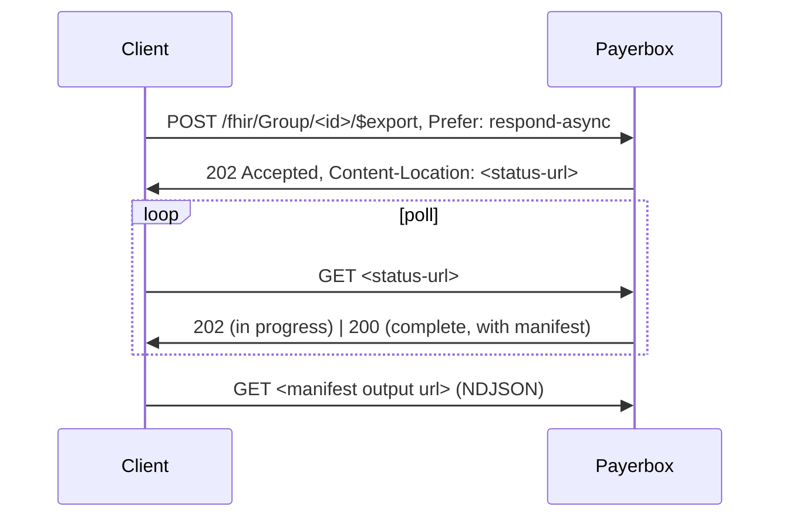

# FHIR RESTful API

The base REST surface across all Payerbox API endpoints. Defined by the [HL7 FHIR R4 RESTful API spec](https://hl7.org/fhir/R4/http.html). Every operation in the other pages of this section is layered on top of this REST surface.

## Base URL

```
<base>/fhir
```

The base for a Payerbox deployment is configured per environment. The CapabilityStatement at `<base>/fhir/metadata` is the canonical source — see [Capability Statement](../capability-statement.md).

## Wire format

```
Content-Type: application/fhir+json
Accept: application/fhir+json
```

XML (`application/fhir+xml`) is also supported but JSON is the default and recommended.

## Authentication

All FHIR endpoints require a bearer token unless explicitly public (e.g., Provider Directory).

```
Authorization: Bearer <access-token>
```

See [Authentication](../authentication.md) for SMART App Launch and Backend Services flows.

## Interactions

### Instance-level

| Verb | Path | Behavior |
|---|---|---|
| GET | `/fhir/<Type>/<id>` | Read one resource |
| GET | `/fhir/<Type>/<id>/_history` | Resource history (all versions) |
| GET | `/fhir/<Type>/<id>/_history/<vid>` | Read a specific version |
| PUT | `/fhir/<Type>/<id>` | Update (or upsert if not exists) |
| DELETE | `/fhir/<Type>/<id>` | Delete |
| PATCH | `/fhir/<Type>/<id>` | Partial update (JSON Patch or FHIR Patch) |

### Type-level

| Verb | Path | Behavior |
|---|---|---|
| GET | `/fhir/<Type>` | Search |
| POST | `/fhir/<Type>` | Create |
| POST | `/fhir/<Type>/_search` | Search with POST (use when query exceeds URL length) |

### System-level

| Verb | Path | Behavior |
|---|---|---|
| GET | `/fhir` | System-level search across all resource types |
| GET | `/fhir/_history` | System-wide history |
| POST | `/fhir` | Transaction or batch (Bundle payload) |
| GET | `/fhir/metadata` | CapabilityStatement |

## Search

Search parameters per resource are declared in the CapabilityStatement (`rest[].resource[].searchParam`).

### Common parameters

| Parameter | Description |
|---|---|
| `_id` | Resource logical id |
| `_lastUpdated` | When the resource was last modified (e.g., `gt2026-01-01`) |
| `_count` | Page size (default 50, max varies per deployment) |
| `_offset` | Page offset (alternative to `Bundle.link[next]`) |
| `_sort` | Sort field and direction (`-` prefix for descending) |
| `_include` | Include related resources (`Coverage:beneficiary`) |
| `_revinclude` | Reverse include (`Location:organization`) |
| `_summary` | Return summary view (`true`, `text`, `count`, `data`, `false`) |
| `_elements` | Limit returned fields |
| `_format` | `json` or `xml` |
| `_pretty` | Pretty-print response |

### Resource-specific examples

```bash
# Patient by identifier
GET <base>/fhir/Patient?identifier=http://hl7.org/fhir/sid/us-mbi|1A23B45C67D8

# All EOBs for a patient, paginated
GET <base>/fhir/ExplanationOfBenefit?patient=<id>&_count=50

# Active in-network practitioners by specialty
GET <base>/fhir/PractitionerRole?network=<id>&specialty=http://nucc.org/provider-taxonomy|207R00000X&active=true

# Observations in a date range
GET <base>/fhir/Observation?patient=<id>&date=ge2025-01-01&date=lt2026-01-01
```

### Pagination

Search returns a `searchset` Bundle with `link[]`:

```json
{
  "resourceType": "Bundle",
  "type": "searchset",
  "total": 137,
  "link": [
    { "relation": "self", "url": "<base>/fhir/Observation?patient=...&_count=50" },
    { "relation": "next", "url": "<base>/fhir/Observation?patient=...&_count=50&_offset=50" }
  ],
  "entry": [ ... ]
}
```

Follow `link[next]` until absent.

## $everything

```bash
GET <base>/fhir/Patient/<id>/$everything
```

Returns a Bundle of all resources scoped to the member: clinical, claims/EOB, encounters, etc. Used by Patient Access apps that want a one-shot pull.

```bash
# With date filter
GET <base>/fhir/Patient/<id>/$everything?start=2024-01-01&end=2026-01-01
```

Returns transaction-bundle style. Large; supports `_count` for pagination.

## Transaction and batch

```bash
POST <base>/fhir
Content-Type: application/fhir+json

{
  "resourceType": "Bundle",
  "type": "transaction",
  "entry": [
    { "request": { "method": "POST", "url": "Patient" }, "resource": { "resourceType": "Patient", "..." : "..." } },
    { "request": { "method": "POST", "url": "Coverage" }, "resource": { "resourceType": "Coverage", "..." : "..." } }
  ]
}
```

`transaction` is all-or-nothing; `batch` is independent per entry. Used by PAS for the Request Bundle (see [PAS](../../prior-auth/pas.md)).

## Conditional operations

| Header | Use |
|---|---|
| `If-Match: W/"<vid>"` | Optimistic concurrency on update |
| `If-None-Exist: <search>` | Conditional create (only if no match) |
| `Prefer: return=representation` | Server returns full resource (default) |
| `Prefer: return=minimal` | Server returns only Location header |
| `Prefer: return=OperationOutcome` | Server returns validation summary |
| `Prefer: respond-async` | Async processing (Bulk Data) |

## Async pattern (Bulk Data)

Long-running operations (`$export`, `$bulk-member-match`, `$davinci-data-export`) follow the [Bulk Data Access async pattern](https://hl7.org/fhir/uv/bulkdata/STU2/async-pattern.html):



The manifest lists per-resource-type NDJSON files; download each and parse line-by-line.

## OperationOutcome

Errors return an `OperationOutcome` resource with HTTP status > 299:

```json
{
  "resourceType": "OperationOutcome",
  "issue": [
    {
      "severity": "error",
      "code": "invalid",
      "details": { "text": "Patient/123 not found" },
      "diagnostics": "..."
    }
  ]
}
```

| HTTP | Common cause |
|---|---|
| 400 | Malformed request |
| 401 | Missing or invalid token |
| 403 | Token lacks required scope |
| 404 | Resource not found |
| 409 | Version conflict (use `If-Match`) |
| 410 | Resource deleted |
| 412 | Precondition failed (`If-None-Exist` matched) |
| 422 | FHIR validation failed |
| 429 | Rate limit |

