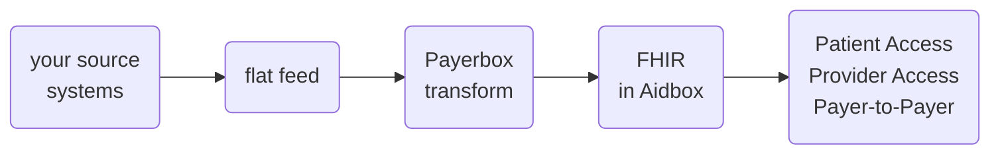

# Data Integration Reference

What you send Payerbox. For each USCDI data class, the columns to deliver and the FHIR they become.

## Data conventions

| Rule | Detail |
|---|---|
| Format | Agreed per engagement. If you deliver CSV: UTF-8, comma-delimited, first row is the headers, named exactly as in the tables. |
| Delivery | Arranged per engagement. PHI: encrypted in transit and at rest under the executed BAA. |
| History (USCDI feed) | Date of service on or after January 1, 2016. Send active and historical records; the status columns mark which is which. |

## Built on US Core

[USCDI](https://isp.healthit.gov/united-states-core-data-interoperability-uscdi#uscdi-v3-1) lists the data. [US Core](https://hl7.org/fhir/us/core/STU6.1/) maps each element to FHIR. Payerbox pins **US Core 6.1.0**, realizing **USCDI v3** ([Implementation Guides](../api-reference/implementation-guides.md)). This feed targets **USCDI v3.1**.

## Feeds

| Feed | Built on | Datasets |
|---|---|---|
| [USCDI v3.1 Data](uscdi/README.md) | US Core 6.1.0 | 24 |
| [Provider Directory](provider-directory/README.md) | PDex Plan-Net STU 1.2.0 | 4 |
