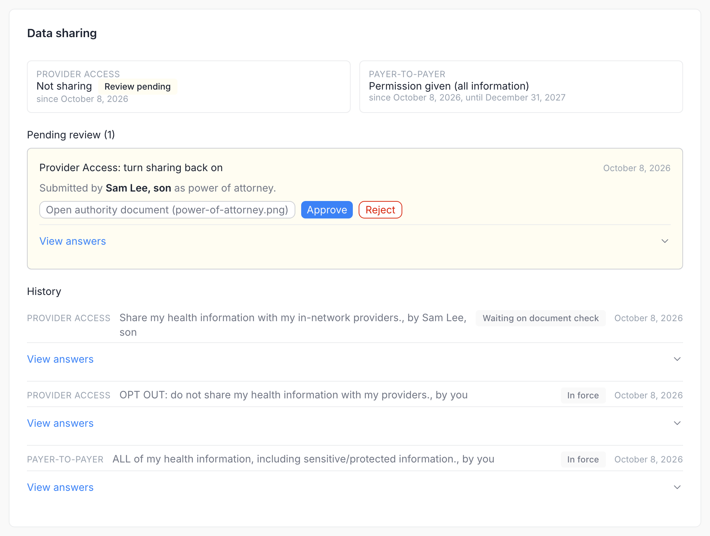
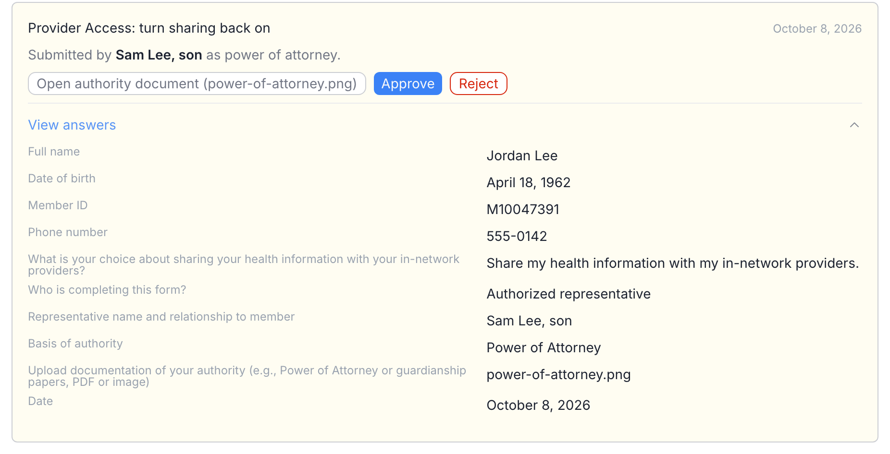
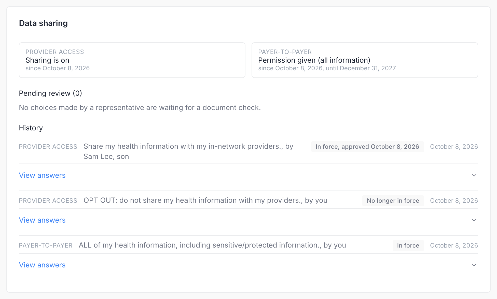

# Consent Reviews

When an authorized representative records a choice that shares more of a member's record (turning Provider Access sharing back on, or authorizing Payer-to-Payer exchange), the choice does not apply until a plan administrator has checked the representative's document of authority. Choices that share less apply at once; the plan checks their document afterwards. See [Authorized representatives](member-portal/consent-panel.md#authorized-representatives) for the member's side. Representatives, and with them reviews, are offered only where the portal runs with `MEMBER_CONSENT_REPRESENTATIVES_ENABLED=true`; elsewhere the card shows no **Pending review** section.

Reviews happen on the member's page: **Members** → the member → **Data sharing** card. The card is shown on deployments that enable the Consent Panel, in both read-write and read-only [capture modes](consent-settings.md#capture-mode).

## What the card shows

| Section | Content |
|---|---|
| Provider Access, Payer-to-Payer | The choice in force for each switch and since when; for Payer-to-Payer also the scope (all information or non-sensitive only) and the end date. **Review pending** marks a switch with a choice waiting for review. |
| **Pending review (N)** | One item per waiting choice: what it does (for example *Provider Access: turn sharing back on* or *Payer-to-Payer: permission, all information*), who submitted it and on what authority, and when. Each item has **Open authority document**, **Approve**, **Reject**, and **View answers**. |
| **History** | Every choice recorded for the member on either switch, newest first, with who submitted it and the same status tags the member sees. **View answers** shows each submission. |

## Review a choice



**Check the document.** **Open authority document** opens the uploaded power of attorney, guardianship papers or equivalent in a new tab.


**Check the answers.** **View answers** lists the form's questions with the answers as submitted: the member block, the choice, who completed the form, the representative's name, basis of authority and document, and the date.



**Decide.** Click **Approve** or **Reject**. The dialog takes an optional **Internal note**, which goes to the audit log only and is never shown to the member. Confirm with **Approve** or **Reject**.




| Decision | Effect |
|---|---|
| **Approve** | The choice takes effect now and replaces the earlier one: the record becomes the one in force and carries its PDex or HRex Consent profile, and the earlier records of that switch are retired. The member's history shows *In force, approved <date>*. |
| **Reject** | The choice is marked as not approved and the earlier choice stays in force. The member's history shows *Not approved*, without the note. |

Both decisions are saved together with a `Provenance` record that names the administrator as verifier, or not at all. If the save fails, for example because the member changed the same choice in the meantime, the card says *The decision could not be saved and nothing was changed. Please try again or contact an administrator.*

After the approval above, the card reads:

## Audit

Every member save writes a **Member Consent Recorded** audit event, and every decision writes **Member Consent Approved** or **Member Consent Rejected** with the administrator and the internal note. They appear in the Admin Portal's **Audit Logs**.

## Related


[consent-panel.md](member-portal/consent-panel.md)



[consent-settings.md](consent-settings.md)



[consent.md](../api-reference/resources/consent.md)

