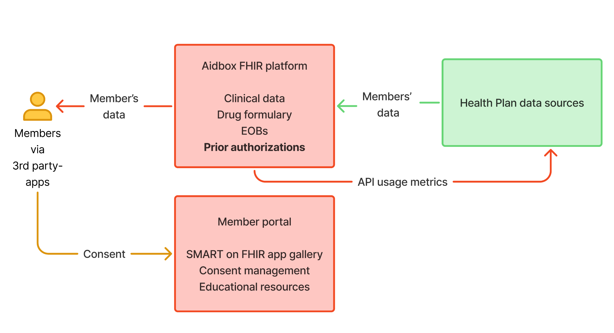

# Patient Access



The Patient Access API exposes a member's clinical, claims, encounter, and prior-authorization data to a member-authorized third-party app. The API is established by CMS-9115-F (effective 2021) and extended by CMS-0057-F (prior-authorization data added, effective January 1, 2027).

## Regulatory anchor

| Rule | Citation | Effective | What it requires |
|---|---|---|---|
| CMS-9115-F | 42 CFR 422.119, 431.60, 438.62(b)(1)(ii), 457.730, 457.1233(d)(2), 45 CFR 156.221 | January 1, 2021 (CMS enforcement July 1, 2021) | Claims, encounters with provider remittances and enrollee cost-sharing, USCDI clinical data |
| CMS-0057-F (extension) | 42 CFR 422.119(b)(5) and parallels | January 1, 2027 | Add prior authorization information: status, dates, items/services approved, denial reason, supporting documentation |
| Annual usage report to CMS | 42 CFR 422.119(f) and parallels | First report 2026 (CY 2025 data) | See [Compliance / Reporting](../compliance/reporting.md) |

See [Compliance / CMS-9115](../compliance/cms-9115.md) and [Compliance / CMS-0057](../compliance/cms-0057.md).

## Caller and auth

| Property | Value |
|---|---|
| Caller | Third-party app, on behalf of a plan member |
| Authentication | SMART App Launch (member-authorized OAuth 2.0) |
| Token endpoint | `<base>/auth/token` |
| App registration | Through the [Developer Portal](../fhir-app-portal/developer-portal.md) |

Member discovers the app in the [Smart App Gallery](../fhir-app-portal/smart-app-gallery.md), signs in via the payer's IdP, and grants the scopes the app requested. See [API Reference / Authentication](../api-reference/authentication.md) for the full SMART App Launch protocol.

## Data scope

| Data class | FHIR resources | Source IG |
|---|---|---|
| USCDI v3 clinical | Patient, AllergyIntolerance, Condition, MedicationRequest, Observation, Procedure, Immunization, DiagnosticReport, DocumentReference, etc. | US Core 6.1.0 |
| Claims and encounters | ExplanationOfBenefit, Coverage, Patient | CARIN Blue Button STU 2.1.0 |
| Cost-sharing and remittance | Embedded in ExplanationOfBenefit | CARIN Blue Button |
| Pharmacy directory (MA-PD only) | Plan-Net resources | PDex Plan Net |
| Drug formulary (MA-PD only) | InsurancePlan, MedicationKnowledge | PDex US Drug Formulary 2.1.0 |
| Prior authorization (from January 1, 2027) | Claim, ClaimResponse, Task, AuditEvent | PDex 2.1.0 |

Service dates: from January 1, 2016 onward (CMS-9115-F).

## Endpoints

The full surface is the FHIR R4 RESTful API rooted at `<base>/fhir`. See [API Reference / Operations / FHIR RESTful API](../api-reference/operations/fhir-restful-api.md).

Common reads:

```
GET <base>/fhir/Patient/{id}
GET <base>/fhir/ExplanationOfBenefit?patient={id}&_count=50
GET <base>/fhir/Condition?patient={id}
GET <base>/fhir/Observation?patient={id}&category=laboratory
GET <base>/fhir/MedicationRequest?patient={id}
GET <base>/fhir/Claim?patient={id}                    # PA data from Jan 1, 2027
```

`$everything` for a one-shot pull of all member-scoped resources:

```
GET <base>/fhir/Patient/{id}/$everything
```

CapabilityStatement: `<base>/fhir/metadata`. See [API Reference / Capability Statement](../api-reference/capability-statement.md).

## Quickstart

1. Register an app in the [Developer Portal](../fhir-app-portal/developer-portal.md). Get a sandbox Client ID and the sandbox base URL.
2. Run SMART App Launch against `<sandbox>/auth/authorize` to obtain an access token for the sample member (`Patient/test-pt-1`).
3. Read claims and clinical data:

```bash
curl -H "Authorization: Bearer $TOKEN" \
  "<sandbox>/fhir/ExplanationOfBenefit?patient=test-pt-1"
```

4. When ready for production, submit the app via the Developer Portal for the payer's review.

## SMART scopes

| Scope | Grants |
|---|---|
| `patient/*.read` | Read all member-scoped resources |
| `patient/ExplanationOfBenefit.read` | Read only EOBs |
| `patient/Observation.read` | Read only observations |
| `openid fhirUser` | Identify the authenticated member |
| `offline_access` | Refresh token for long-lived access |

Apps must request the minimum scopes needed. Members see the scope list on the consent screen.

Full scope inventory: [API Reference / Authentication](../api-reference/authentication.md).

## Member opt-out

CMS-9115-F is opt-in by member action — a member explicitly authorizes each third-party app via SMART App Launch. There is no separate member opt-out for Patient Access (unlike Provider Access, which is opt-out, and Payer-to-Payer, which is opt-in via enrollment).

A member who wants to stop an app from receiving data revokes the app's access from the [Smart App Gallery](../fhir-app-portal/smart-app-gallery.md). Revocation invalidates the refresh token immediately.

## Common errors

| HTTP | OperationOutcome code | Cause | Resolution |
|---|---|---|---|
| 401 | `security` | Missing or expired access token | Refresh token via `/auth/token` |
| 403 | `forbidden` | Scope mismatch (e.g., requested resource not in granted scopes) | Request the right scope at next authorization |
| 404 | `not-found` | Patient ID does not match the authenticated member | Use the `patient` claim from the access token, not a hardcoded ID |
| 410 | `expired` | Resource version was deleted | Re-query without `_history` |
| 429 | `throttled` | Rate limit exceeded | Back off per `Retry-After` header |

Full catalog: [API Reference / OperationOutcome](../api-reference/README.md).

## What Payerbox covers

- All required FHIR IGs preconfigured.
- UM-system integration: PA decisions appear in the Patient Access response within one business day regardless of submission channel.
- OAuth 2.0, OIDC, and SMART App Launch across the FHIR endpoints.
- Member-facing Smart App Gallery for one-click launch of approved apps — see [Smart App Gallery](../fhir-app-portal/smart-app-gallery.md).
- Developer Portal for third-party app registration, sandbox, and testing — see [Developer Portal](../fhir-app-portal/developer-portal.md).
- Resource-level audit logs covering the fields required for the annual CMS Patient Access metrics report — see [Compliance / Reporting](../compliance/reporting.md).

