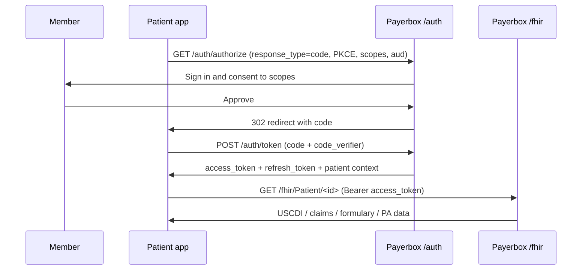

# Patient Access API

The Patient Access API lets a member authorize a third-party app to read their own claims, clinical, encounter, formulary, and prior-authorization data over FHIR R4. Established by [CMS-9115-F](../compliance/cms-9115.md), in production since January 1, 2021; [CMS-0057-F](../compliance/cms-0057.md) adds prior-authorization data effective January 1, 2027.

## What Payerbox covers

- Aidbox FHIR R4 with US Core 6.1.0 preloaded; [CARIN IG for Blue Button](https://hl7.org/fhir/us/carin-bb/), [PDex](https://hl7.org/fhir/us/davinci-pdex/), and [PDex US Drug Formulary](https://hl7.org/fhir/us/davinci-drug-formulary/) added via FHIR package configuration when profile validation is needed.
- SMART App Launch 2.0.0 Standalone Launch out of the box — OAuth 2.0 authorization-code with PKCE for public clients, client-secret for confidential clients, OpenID Connect for member identity, `offline_access` for refresh-token sync.
- [FHIR App Portal](../fhir-app-portal/README.md) for member-facing app discovery and the [Developer Portal](../fhir-app-portal/developer-portal.md) for third-party app registration.
- Per-app audit logging of every member access.
- Bulk `$export` available for the payer's internal aggregation; Patient Access apps themselves use synchronous REST.

## Caller and auth

| Property | Value |
|---|---|
| Caller | Third-party app the member authorizes (mobile, web, desktop) |
| Authentication | SMART App Launch 2.0.0 Standalone Launch — OAuth 2.0 authorization code, PKCE for public clients, OpenID Connect for identity |
| Discovery | `<base>/.well-known/smart-configuration` |
| Authorization endpoint | `<base>/auth/authorize` |
| Token endpoint | `<base>/auth/token` |
| CapabilityStatement | `<base>/fhir/metadata` |

See [API Reference / Authentication](../api-reference/authentication.md) for the full SMART Standalone Launch flow, scope syntax, and PKCE details.

## Launch flow

Standalone Launch is the only relevant pattern — the member opens the app, the app sends them to Payerbox to sign in and grant scopes, then calls the FHIR API with the returned token. There is no EHR launch for member-driven Patient Access.



The access token's `patient` claim names which member the app may read. Payerbox scopes every query to that patient automatically — an app cannot read another member by ID.

## Common scope sets

Standalone-launch read-only is the typical preset; write scopes are rare for Patient Access.

| Use | Scopes |
|---|---|
| Read everything (recommended default) | `openid fhirUser launch/patient offline_access patient/*.read` |
| Read specific resources only | `openid fhirUser launch/patient offline_access patient/Patient.r patient/Observation.r patient/ExplanationOfBenefit.r` |
| V2 syntax (SMART v2 `.cruds`) | `openid fhirUser launch/patient offline_access patient/Patient.rs patient/Observation.rs` |

Full scope inventory: `<base>/.well-known/smart-configuration#scopes_supported`.

## Data scope

What a member can read through the API, per CMS-9115-F minimum:

| Data class | FHIR resources | IG |
|---|---|---|
| USCDI clinical | Patient, Condition, Observation, MedicationRequest, AllergyIntolerance, Procedure, Immunization, DocumentReference, ... | US Core 6.1.0 |
| Adjudicated claims with remittances and enrollee cost-sharing | ExplanationOfBenefit, Claim, Coverage | CARIN IG for Blue Button 2.0.0 / 2.1.0 |
| Encounters with capitated providers | Encounter | US Core 6.1.0 |
| Lab results | Observation (`category=laboratory`) | US Core 6.1.0 |
| Drug formulary (MA-PD only) | InsurancePlan, Basic (formulary item), MedicationKnowledge | PDex US Drug Formulary 2.0.1 / 2.1.0 |
| Prior authorization (effective January 1, 2027) | Claim, ClaimResponse, Task | PDex 2.0.0 / 2.1.0 |

Service date floor: **January 1, 2016**.

The payer is responsible for landing claim and encounter data in Payerbox **no later than one business day** after adjudication / receipt — that SLA is on the payer's ingestion feed, not the FHIR server.

## Read examples

```bash
# Member demographics
GET <base>/fhir/Patient/<id>

# Lab results
GET <base>/fhir/Observation?patient=<id>&category=laboratory

# Adjudicated claims (EOBs)
GET <base>/fhir/ExplanationOfBenefit?patient=<id>&_count=50

# Active coverages
GET <base>/fhir/Coverage?patient=<id>&status=active

# Drug formulary (MA-PD)
GET <base>/fhir/InsurancePlan?_profile=http://hl7.org/fhir/us/davinci-drug-formulary/StructureDefinition/usdf-PayerInsurancePlan-PlanNet
```

Every request carries the member's `Authorization: Bearer <access-token>` header; the server filters results to the token's patient context.

## Refresh and re-authorization

Apps request the `offline_access` scope to receive a refresh token alongside the access token, allowing background sync without re-prompting the member. SMART v2.2.0 implementers should rotate refresh tokens per the IG; Payerbox supports both rotating and non-rotating modes.

A member can revoke any app's access at any time from the [FHIR App Portal](../fhir-app-portal/README.md) — Payerbox invalidates the refresh token on revocation.

## Limitations

- **Opt-in per app.** The member authorizes each third-party app separately. There is no payer-wide consent equivalent to Provider Access's opt-out model.
- **Prior authorization data lands January 1, 2027.** Before that date, `Claim`, `ClaimResponse`, and `Task` resources for prior-auth need not be exposed.
- **No `$export` on member-scoped tokens.** Bulk export is a system-level operation used by the payer; member apps use synchronous REST.
- **Single patient per token.** A guardian or personal representative needs separate tokens per dependent member, granted via the FHIR App Portal proxy flow.
