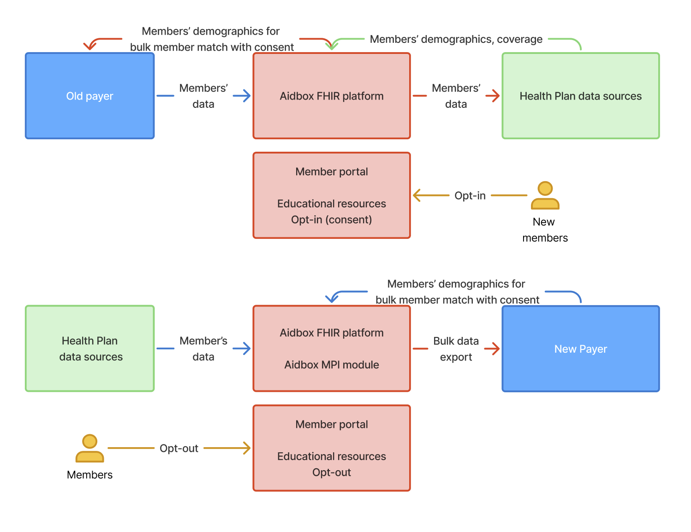

# Payer-to-Payer



The Payer-to-Payer API lets a receiving payer (new plan) pull a member's clinical, claims, encounter, and prior-authorization history from a previous payer when the member changes coverage. Established by CMS-0057-F, effective January 1, 2027. Replaces the suspended 9115 P2P provision.

## Regulatory anchor

| Property | Value |
|---|---|
| Rule | CMS-0057-F |
| Citation | 42 CFR 422.119(g) and parallels |
| Compliance date | January 1, 2027 |
| Trigger | Member changes payers and opts in |
| Consent model | Opt-in (member must affirmatively consent during enrollment) |
| Data window | Five years before the request |
| Exclusions | Drug prior authorizations; denied prior authorizations; provider remittances; enrollee cost-sharing |

See [Compliance / CMS-0057](../compliance/cms-0057.md).

## Caller and auth

| Property | Value |
|---|---|
| Caller | Receiving payer (the new plan) |
| Authentication | SMART Backend Services Authorization (asymmetric JWT, system-level scope) |
| Token endpoint | `<base>/auth/token` on the responding payer's deployment |

The two payers exchange JWKS endpoints out-of-band (or pre-shared keys) at onboarding time.

See [API Reference / Authentication](../api-reference/authentication.md).

## Consent

CMS-0057-F prescribes **opt-in** for Payer-to-Payer. The receiving payer collects the member's opt-in during enrollment and stores the consent record. On `$bulk-member-match`, the receiving payer asserts the consent in the request payload. The responding payer validates the consent assertion before returning data.

Members can withdraw consent. Withdrawal is captured by the receiving payer and stops further requests.

## Data scope

Five-year window of clinical and claims data, excluding remittances, cost-sharing, drug PAs, and denied PAs.

| Data class | FHIR resources | IG |
|---|---|---|
| USCDI v3 clinical | Patient, Condition, Observation, MedicationRequest, etc. | US Core 6.1.0 |
| Claims and encounters (no remittance, no cost-sharing) | ExplanationOfBenefit (filtered), Claim, Coverage | PDex 2.1.0 |
| Prior authorization (excluding drug PAs and denied PAs) | Claim, ClaimResponse, Task | PDex 2.1.0 |

## Operations

### `$bulk-member-match`

The receiving payer submits a list of members with demographics and prior coverage references; the responding payer matches and returns three Group resources.

```bash
POST <base>/fhir/$bulk-member-match
Authorization: Bearer <access-token>
Prefer: respond-async
Content-Type: application/fhir+json
```

Three Groups in the response:

| Group | Profile | Contents |
|---|---|---|
| MatchedMembers | `PDexMemberMatchGroup` | Members confirmed as former enrollees, consent valid |
| NonMatchedMembers | `PDexMemberMatchGroup` | Members no match could be found for |
| ConsentConstrainedMembers | `PDexMemberMatchGroup` | Members matched, but consent prevents data sharing |

Sync and async modes are both supported. Async (`Prefer: respond-async`) is recommended for batches over a few hundred members.

See [API Reference / Operations / $bulk-member-match](../api-reference/operations/bulk-member-match.md).

### `$davinci-data-export` with `payertopayer` exportType

The receiving payer triggers export on the MatchedMembers group:

```bash
POST <base>/fhir/Group/<matched-group-id>/$davinci-data-export?exportType=payertopayer
Authorization: Bearer <access-token>
Prefer: respond-async
```

Response: `202 Accepted` with status URL. On completion, NDJSON manifest URLs by resource type. Receiving payer ingests the bundles.

See [API Reference / Operations / $davinci-data-export](../api-reference/operations/davinci-data-export.md).

## Quickstart

1. Onboard with the responding payer: exchange Client ID, JWKS, agreed IG versions.
2. At new-member enrollment, capture opt-in consent. Store the consent record.
3. Sign a JWT, request token at the responding payer's `/auth/token` with `system/*.read` scope.
4. Submit `$bulk-member-match`:

```bash
curl -X POST -H "Authorization: Bearer $TOKEN" \
  -H "Prefer: respond-async" \
  -d @member-list.json \
  "<base>/fhir/\$bulk-member-match"
```

5. Poll the status URL until match completes. Capture the three Group IDs.
6. Trigger export on the MatchedMembers Group.
7. Poll until export complete; ingest the NDJSON.

## Common errors

| HTTP | OperationOutcome code | Cause |
|---|---|---|
| 401 | `security` | JWT signature invalid or expired |
| 403 | `forbidden` | Requesting payer not registered as a P2P partner |
| 422 | `business-rule` | Consent assertion missing or invalid |
| 422 | `processing` | Member match returned NoMatch or ConsentConstrained — no data exported |

## What Payerbox covers

- FHIR `$bulk-member-match` with sync and async modes.
- Five-year member history on demand: clinical, claims, encounters.
- FHIR `Consent` resources with full audit trail of opt-in capture and revocation.

