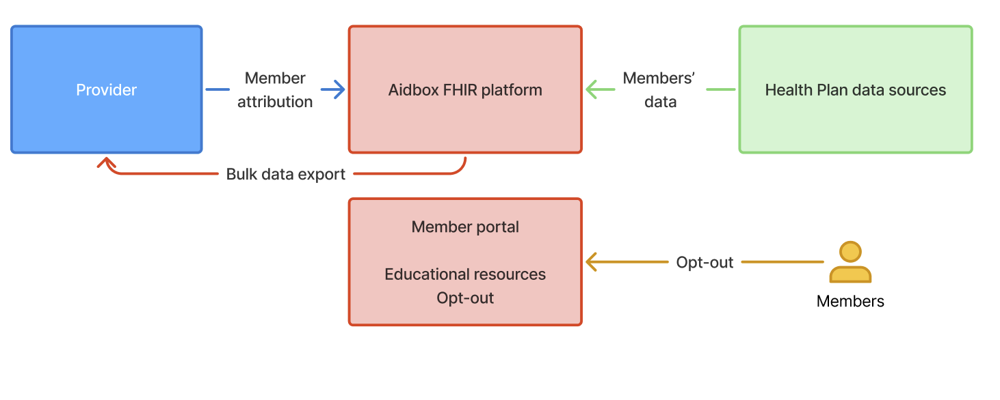

# Provider Access



The Provider Access API exposes a member's clinical, claims, encounter, and prior-authorization data to in-network providers with a treatment relationship. Established by CMS-0057-F, effective January 1, 2027.

## Regulatory anchor

| Property | Value |
|---|---|
| Rule | CMS-0057-F |
| Citations | 42 CFR 422.121 (MA), 431.61 (Medicaid FFS), 438.62(b)(1)(iii) (Medicaid MCO), 457.731 (CHIP FFS), 457.1233(d)(4) (CHIP MCO), 45 CFR 156.222 (QHP issuers on FFE) |
| Compliance date | January 1, 2027 |
| Response time | Within one business day of an authenticated request |
| Consent model | Opt-out (member-driven; applies to all in-network providers) |
| Member education | Plain-language materials before first availability, within one week of enrollment, and annually |

See [Compliance / CMS-0057](../compliance/cms-0057.md).

## Caller and auth

| Property | Value |
|---|---|
| Caller | In-network provider system (EHR, care-coordination platform) |
| Authentication | SMART Backend Services Authorization (asymmetric JWT, system-level scope) |
| Token endpoint | `<base>/auth/token` |

See [API Reference / Authentication](../api-reference/authentication.md).

## Attribution

Payerbox maintains an **attribution roster** mapping each in-network provider to the members the payer considers attributed to that provider. A provider can request data only for members on its roster. The roster is the gating mechanism — there is no per-call consent check beyond it and the member opt-out list.

Roster maintenance is the payer's operational responsibility (assignment rules, PCP changes, panel updates). See [Run Payerbox / Connect Systems](../run-payerbox/README.md).

> TODO(engineering): document attribution roster ingestion format and update cadence.

## Consent model

CMS-0057-F prescribes **opt-out** for Provider Access. A member who opts out is removed from the data response for all providers — no provider-by-provider granularity.

Opt-out is captured by the payer (typically via the member portal or call center) and surfaced to the API as a flag on Patient. Provider Access filters out opted-out members before responding.

## Data scope

Same set as Patient Access, excluding provider remittances and enrollee cost-sharing.

| Data class | FHIR resources | IG |
|---|---|---|
| USCDI v3 clinical | Patient, Condition, Observation, MedicationRequest, etc. | US Core 6.1.0 |
| Claims and encounters (no remittance, no cost-sharing) | ExplanationOfBenefit (filtered), Claim, Coverage | PDex 2.1.0 |
| Prior authorization | Claim, ClaimResponse, Task | PDex 2.1.0 |

Service dates: from January 1, 2016 onward.

## Operations

### `Group/[id]/$export`

Bulk export of all resources for the group of members attributed to the calling provider.

```bash
POST <base>/fhir/Group/<provider-group-id>/$export
Authorization: Bearer <access-token>
Prefer: respond-async
Accept: application/fhir+json
```

Response: `202 Accepted` with `Content-Location` header pointing at a status URL. Poll the status URL; when complete, it returns an `output` array of NDJSON file URLs grouped by resource type.

See [API Reference / Operations / $davinci-data-export](../api-reference/operations/davinci-data-export.md).

### `$provider-member-match`

Provider-initiated attribution (v2 path): the provider submits a list of patients it treats; the payer matches them against enrolled members and creates a Group resource for subsequent `$export`.

```bash
POST <base>/fhir/$provider-member-match
Authorization: Bearer <access-token>
Content-Type: application/fhir+json
```

See [API Reference / Operations / $provider-member-match](../api-reference/operations/provider-member-match.md).

## Quickstart

1. Receive Backend Services credentials from the payer (Client ID, JWKS endpoint or pre-shared public key).
2. Sign a JWT and request a token at `<base>/auth/token` with `scope=system/*.read`.
3. Discover the Group for the provider:

```bash
curl -H "Authorization: Bearer $TOKEN" \
  "<base>/fhir/Group?managing-entity=Organization/<provider-org-id>"
```

4. Trigger bulk export:

```bash
curl -X POST -H "Authorization: Bearer $TOKEN" \
  -H "Prefer: respond-async" \
  "<base>/fhir/Group/<group-id>/\$export"
```

5. Poll the returned `Content-Location` until the status response includes the manifest with NDJSON URLs.

## Common errors

| HTTP | OperationOutcome code | Cause |
|---|---|---|
| 401 | `security` | Invalid or expired access token; check JWT signature and `exp` |
| 403 | `forbidden` | Requested Group does not belong to the authenticated provider |
| 404 | `not-found` | Group not found (member not yet attributed or attribution flushed) |
| 422 | `processing` | Member opted out — not returned in export |
| 429 | `throttled` | Rate limit hit; back off per `Retry-After` |

## What Payerbox covers

- All required IGs preconfigured.
- FHIR Bulk Data export with async processing.
- Plugs into the payer's existing attribution: ingests Group resources, lookups, or any format the payer maintains. No master-data migration required.
- Audit logs and access tracking per provider request, scoped to the requesting provider's Group.

