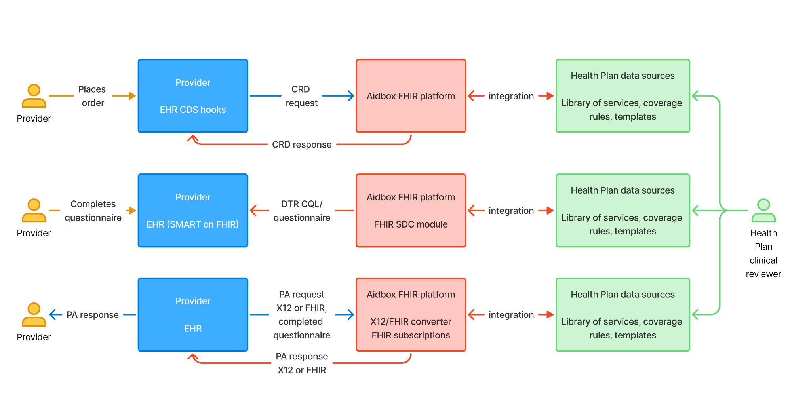

# Prior Auth (ePA) APIs

Da Vinci electronic Prior Authorization stack. CMS-0057-F requires a FHIR-based Prior Authorization API by January 1, 2027. Payerbox implements the Da Vinci CRD, DTR, and PAS Implementation Guides — see [Compliance / CMS-0057](../compliance/cms-0057.md).

| Page | IG | Role |
|---|---|---|
| [CRD](crd.md) | Da Vinci CRD STU 2.0.1 | Discover whether prior authorization is required at the point of order |
| [DTR](dtr/README.md) | Da Vinci DTR STU 2.0.0 | Collect required documentation via questionnaires driven by CQL |
| [PAS](pas.md) | Da Vinci PAS STU 2.1.0 | Submit the prior authorization request and receive the response |

The three IGs compose: CRD identifies the rule, DTR collects the evidence, PAS submits the request.
