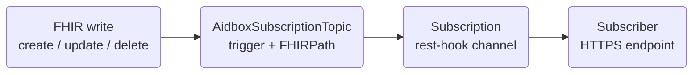

# Event Notifications

Payerbox can push FHIR resource events to subscribers as they happen — for example, notifying a downstream system the moment a prior-authorization decision is recorded on a `ClaimResponse`. It is built on **FHIR R4B topic-based subscriptions** and configured entirely through standard FHIR resources.

For the regulatory and workflow context of the events themselves, see [PAS](pas.md). For platform details beyond what this page covers, see [FHIR Topic-Based Subscriptions](https://www.health-samurai.io/docs/aidbox/modules/topic-based-subscriptions/fhir-topic-based-subscriptions) in the Aidbox docs.

## How it works

Two resources work together:

| Resource | Role |
|---|---|
| `AidboxSubscriptionTopic` | The **topic** — which resource type, an optional FHIRPath criterion, and which interactions (create / update / delete) fire it. Models the FHIR `SubscriptionTopic` concept. |
| `Subscription` | The **subscriber** — a standard FHIR R4B `Subscription` a client creates to receive notifications. It references the topic and carries the delivery channel (a rest-hook endpoint). |

When a CRUD operation matches a topic's trigger, Aidbox delivers a notification bundle to every active `Subscription` bound to that topic. Delivery is asynchronous, so a slow or unavailable subscriber never blocks the originating FHIR write.



### Delivery lifecycle

A `Subscription` moves through a handshake before it delivers events:

1. **`requested`** — the state a new `Subscription` is created in. Aidbox immediately POSTs a **handshake** notification (a bundle whose `SubscriptionStatus.type` is `handshake`) to the channel endpoint to validate it.
2. **`active`** — the endpoint answered the handshake with an HTTP `2xx`. Only then does Aidbox begin delivering event notifications. A non-2xx leaves the subscription inactive.
3. **`error` / `off`** — repeated delivery failures deactivate the subscription; it must be re-created or reset to resume.

Each event notification is a `Bundle` containing a `SubscriptionStatus` resource (event metadata) followed by the triggering resource(s). If a heartbeat period is configured, Aidbox also sends periodic empty notifications during idle stretches so the subscriber can tell a quiet pipeline from a broken one.

## Configure a notification

Create the resources below with admin credentials. In production they are usually provisioned from an init-bundle — see [Provisioning at deploy time](#provisioning-at-deploy-time).




### Define the subscription topic

Declare what to notify on. `trigger.fhirPathCriteria` narrows the firing condition; omit it to fire on every interaction of the resource type. For Prior Auth, trigger on the `ClaimResponse` that carries the decision.


```json
{
  "resourceType": "AidboxSubscriptionTopic",
  "id": "pas-claimresponse-status",
  "url": "http://prior-auth.example.org/SubscriptionTopic/pas-claimresponse-status",
  "status": "active",
  "description": "Notify when PAS ClaimResponses are created or updated",
  "trigger": [
    {"resource": "ClaimResponse", "fhirPathCriteria": "use = 'preauthorization'"}
  ]
}
```





### Create the Subscription

Create a standard FHIR R4B `Subscription` whose `criteria` is the topic `url` and whose `channel` is a rest-hook pointing at your endpoint. The R4B backport extensions select the payload content and an optional heartbeat.


```json
{
  "resourceType": "Subscription",
  "id": "pas-claimresponse-sub",
  "status": "requested",
  "reason": "Downstream PA decision notifications",
  "criteria": "http://prior-auth.example.org/SubscriptionTopic/pas-claimresponse-status",
  "channel": {
    "type": "rest-hook",
    "endpoint": "https://downstream.example.org/fhir/notifications",
    "payload": "application/fhir+json",
    "header": ["Authorization: Bearer <token>"]
  },
  "extension": [
    {
      "url": "http://hl7.org/fhir/StructureDefinition/backport-payload-content",
      "valueCode": "full-resource"
    },
    {
      "url": "http://hl7.org/fhir/StructureDefinition/backport-heartbeat-period",
      "valueUnsignedInt": 60
    }
  ]
}
```


| Field | Description |
|---|---|
| `criteria` (required) | The `AidboxSubscriptionTopic.url` to subscribe to. |
| `channel.type` (required) | `rest-hook` — Aidbox POSTs each notification to the endpoint. |
| `channel.endpoint` (required) | HTTPS URL that receives the notification bundle. Must answer the handshake with a `2xx`. |
| `channel.payload` | MIME type of the delivered body, e.g. `application/fhir+json`. |
| `channel.header` | Custom HTTP headers sent with every delivery — use for the subscriber's auth token. |
| `backport-payload-content` | `full-resource` (whole resource), `id-only` (reference only), or `empty` (notification metadata only). |
| `backport-heartbeat-period` | Seconds between empty keep-alive notifications during inactivity. Omit to disable. |


The endpoint must be reachable and return `2xx` to the handshake, or the subscription never leaves `requested` and no events are delivered.





### Verify

On create, confirm the subscription reached `active` (`GET /Subscription/pas-claimresponse-sub` → `status`). Then trigger a matching write and confirm the bundle arrives at your endpoint — its first entry is a `SubscriptionStatus`, followed by the `ClaimResponse`.




## The notification bundle

With `backport-payload-content: full-resource`, each delivery carries the complete triggering resource. For Prior Auth this is the `ClaimResponse` whose `reviewAction` extension conveys the decision (e.g. X12 `A1` = certified, `A3` = not certified, `A4` = pended — see [PAS](pas.md)). A subscriber that needs the full referenced context (Claim, Patient, Coverage) can resolve those references against the FHIR API, or use the AWS SNS extension below, which can ship them pre-resolved.

A subscriber that triggers on `Claim` instead finds the `ClaimResponse` id in the `claim-response-reference` extension Payerbox adds to the stored `Claim` (see [Claim/$submit](../api-reference/operations/claim-submit.md#claimresponse-link)), so it correlates the pair without a separate lookup.

## Provisioning at deploy time

In production these resources are created from an init-bundle rather than by hand, with environment-variable substitution for environment-specific values (endpoint URL, auth token). One ordering rule applies: a subscription topic must exist before any `Subscription` that references its `url`.

## AWS SNS delivery (Payerbox extension)

Some deployments need events delivered to **AWS SNS** rather than a rest-hook endpoint — for example, fanning a PA decision out to an existing SQS/SNS pipeline. For these, Payerbox ships a set of custom `AidboxTopicDestination` kinds (`custom-aws-sns-at-least-once`, `custom-aws-sns-best-effort`, and a PAS-specific `pas-rest-hook-at-least-once` that assembles a Da Vinci PAS Response Bundle). They reuse the same `AidboxSubscriptionTopic` trigger but replace the standard `Subscription` with an `AidboxTopicDestination` sink, and can optionally enrich the payload with the triggering resource's referenced resources.

This is a Payerbox extension provisioned per integration, not part of the standard FHIR subscription path above. Two operational notes carry over from `AidboxTopicDestination`:

- **Custom profiles must be whitelisted.** The `custom-aws-sns-*` profiles are added to the `AidboxTopicDestination` `allow-destinations` constraint before any destination using them is created.
- **Destinations are immutable.** Aidbox rejects `PUT`/`PATCH` on an existing `AidboxTopicDestination`; to change a target (ARN, region) delete and re-create it.

If your deployment uses this extension, ask your Payerbox contact for the destination configuration reference.

## Gotchas

- **Handlers must be idempotent.** At-least-once delivery can repeat an event. Deduplicate on the resource id and version, or guard with your own idempotency key.
- **Updates re-fire.** The topic fires on every interaction matching the criterion, including writes your own subscriber makes back into Aidbox. Avoid feedback loops when subscribing to a resource your downstream also updates.
- **A subscription stuck in `requested` is not delivering.** It means the handshake never got a `2xx` — check endpoint reachability, TLS, and auth headers.

## Related


[pas.md](pas.md)



[observability.md](../run-payerbox/maintain/observability.md)

