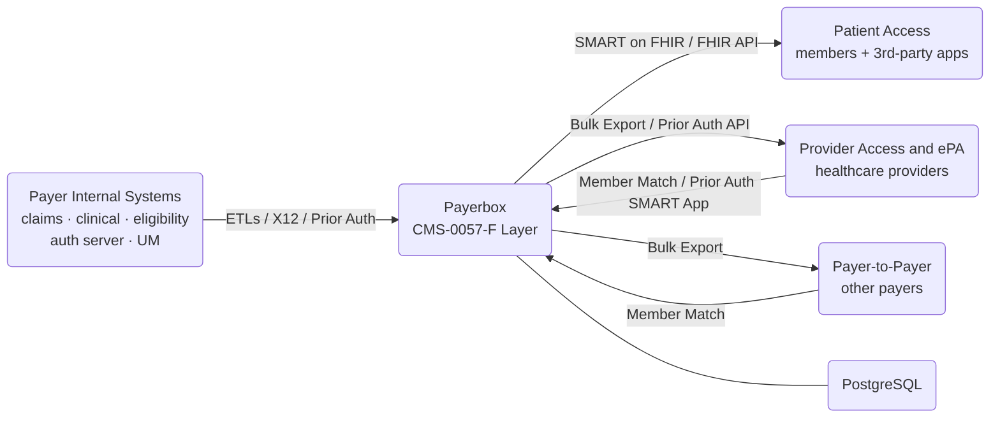
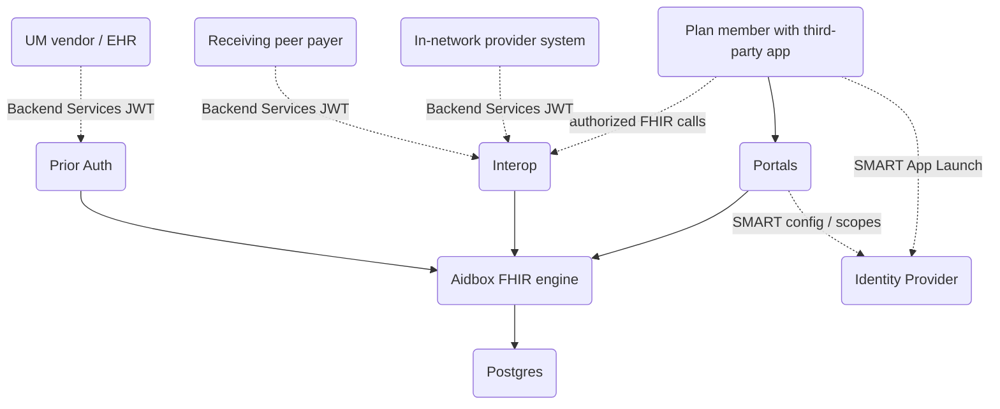
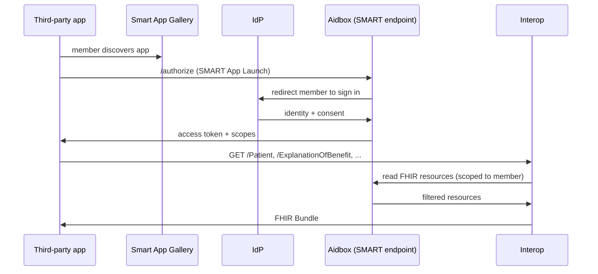
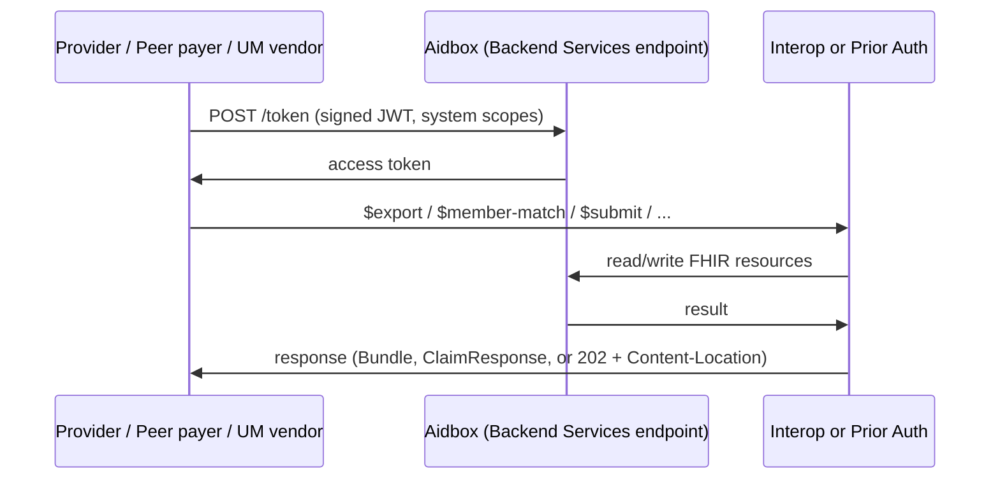

# Architecture

Payerbox is the CMS-0057-F compliance layer for a US health plan. It sits between the payer's internal systems and the external consumers the rules regulate.

## Context

## Internal composition

Payerbox is composed of four Docker images plus Postgres. Each image is independently versioned. All FHIR storage and audit live in Aidbox; the other three images are application layers that read and write through Aidbox.

| Image | Role | Responsibilities |
|---|---|---|
| **Aidbox** | FHIR engine | FHIR R4 storage, search, validation, terminology, SMART App Launch and Backend Services auth, audit log, CapabilityStatement, bulk export, Plan-Net REST endpoints, Multibox multi-tenancy |
| **Interop** | CMS APIs application layer | Provider Access, Payer-to-Payer named operations: `$provider-member-match`, `$bulk-member-match`, `$davinci-data-export`. Owns the kick-off / status / cancel endpoints; the actual bulk export and Plan-Net REST are served by Aidbox |
| **Prior Auth** | ePA application layer | CRD CDS Hooks endpoints, PAS `Claim/$submit` / `Claim/$inquire` / `$submit-attachment`. DTR `$questionnaire-package` is served by Aidbox (the DTR FHIR package is loaded). X12 278 mapping happens inside Prior Auth |
| **Portals** | Web UIs | Admin Portal, Developer Portal, FHIR App Gallery. Single Docker image with Nginx domain-based routing |

External dependencies:

| Dependency | Purpose |
|---|---|
| PostgreSQL | FHIR storage |
| Identity provider | Member sign-in (SMART App Launch) and Admin Portal sign-in. Keycloak ships with the dev bundle; production uses the payer's IdP. |
| Object storage (S3-compatible) | NDJSON manifests for bulk export |
| External decision service | CRD coverage rules (configured via `CDS_DECISION_SERVICE_URL`) |
| External UM system | Authoritative authorization decision; receives X12 278 from Prior Auth |

## Component view

## Authentication chain

Two flows, depending on who is calling.

### Member-facing apps (Patient Access)

### System-to-system (Provider Access, Payer-to-Payer, PAS)

## Data flow per API surface

| API | Caller | Path |
|---|---|---|
| Patient Access | Member app (SMART) | App → Aidbox /authorize → Interop FHIR endpoints → Aidbox storage |
| Provider Access (payer-attributed) | Provider system (Backend Services) | Provider → Aidbox /token → Interop `Group/$export` on the payer's attribution roster Group → response excludes members who have opted out |
| Provider Access (provider-attributed) | Provider system (Backend Services) | Provider → Aidbox /token → Interop `$provider-member-match` (provider submits member list; Interop matches and creates a Group) → Interop `Group/$export` on that Group → response excludes members who have opted out |
| Payer-to-Payer | Receiving payer (Backend Services) | Receiver → Aidbox /token → Interop `$bulk-member-match` (consent-asserted) → Interop `$davinci-data-export` on MatchedMembers Group → Aidbox storage |
| Provider Directory | Anyone (public) | Caller → Aidbox public Plan-Net REST endpoints (Aidbox access policy allows unauthenticated `GET` on Plan-Net resource types) |
| CRD | EHR (CDS Hooks) | EHR → Prior Auth CDS Hooks endpoint → Aidbox (validate + persist request resources) → fetch missing references from the EHR's `fhirServer` → proxy to external decision service → response cards |
| DTR | EHR (SMART app) | EHR → Aidbox `$questionnaire-package` (DTR FHIR package loaded; CQL runs in the DTR client, not on Aidbox) |
| PAS | EHR / UM vendor (Backend Services) | Client → Aidbox `/auth/token` → Prior Auth `Claim/$submit` → ClaimResponse stored in Aidbox; X12 278 mapping happens inside Prior Auth |

## Ingestion from payer internal systems

Payerbox is the destination, not the source, of payer reference data. The payer pushes data in through:

| Source | Transport |
|---|---|
| Claims data warehouse | Scheduled ETL (FHIR Bundle ingest or direct SQL) |
| Clinical data | ETL pipeline |
| Eligibility | X12 270/271 or FHIR Coverage push |
| UM (prior auth) | X12 278 bidirectional |
| Provider data management | FHIR Bundle push or Plan Net ingest |

## What's built on top

The same FHIR data Payerbox exposes externally is available to the payer's downstream uses through Postgres or the FHIR APIs:

- Risk Adjustment and Stars analytics
- AI / automation pipelines
- TEFCA queries
- BI and reporting
- Care management apps
- Custom internal applications

Payerbox does not provide these capabilities itself; it provides the FHIR foundation they consume.

## Storage

All FHIR resources live in Postgres, accessed through Aidbox. Interop and Prior Auth do not maintain their own state — they translate requests, apply business rules (attribution, consent, X12 mapping), and forward to Aidbox.

Multi-tenancy uses Aidbox **Multibox** mode when one Payerbox deployment serves multiple legal entities (for example, a TPA running APIs for several plans).

## Production deployment

Standard pattern: each image runs as a separate Kubernetes Deployment behind an Ingress. Postgres is managed (RDS, Cloud SQL, AlloyDB, Azure Database). Object storage is S3, GCS, or Azure Blob. IdP is the payer's existing OIDC provider.

See [Deploy](deploy.md) for runbooks.

## Default ports in the quickstart bundle

| Service | Host port | URL |
|---|---|---|
| Postgres | 5444 | — |
| Aidbox Admin (admin / multi-tenant control) | 8080 | `http://localhost:8080` |
| Aidbox Dev (sandbox FHIR base) | 8090 | `http://localhost:8090` |
| Portals (Admin + Developer + App Gallery) | 8095 / 8096 | Domain-based routing |
| Prior Auth | 8088 | `http://localhost:8088` |
| Interop | 8089 (host) → 8088 (container) | `http://localhost:8089` |
| MinIO (S3-compatible object storage) | 9000 / 9001 | `http://localhost:9000`, console `http://localhost:9001` |

## Related

- [Deploy](deploy.md) — installation runbooks per environment
- [Maintain / Observability](maintain/observability.md) — metrics, audit logs, runbooks
- [Maintain / Upgrade](maintain/upgrade.md) — per-image lifecycle
- [API Reference / Authentication](../api-reference/authentication.md) — SMART and Backend Services flows in detail
