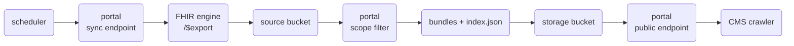

# Deploy

The **`payerbox`** umbrella Helm chart deploys the whole Payerbox stack into a single namespace
with one release:

- **FHIR App Portal** — admin + developer portals
- **Interop APIs** — Patient / Provider / Payer-to-Payer / Provider Directory
- **Prior Auth** — CRD / DTR / PAS
- **Two Aidbox FHIR servers** — `aidbox-admin` (production data) and `aidbox-sandbox` (developer/test data)

You do **not** need Aidbox installed beforehand — the chart brings both Aidbox instances. The chart
deploys only the applications and Aidbox; you provide the **database**, **Secrets**, **ingress/TLS**,
and **Aidbox licenses** (everything below). For the component topology, see
[Architecture](architecture.md).

## Prerequisites

| Requirement | Notes |
|---|---|
| **Kubernetes cluster** + `kubectl` | any conformant cluster (managed or self-hosted) |
| **Helm** 3.14+ | `helm version` |
| **PostgreSQL** with two databases (`portal`, `sandbox`) | [CloudNativePG](https://cloudnative-pg.io/) is the reference; any reachable Postgres works |
| **Ingress controller** (e.g. ingress-nginx) | for external access to the portals and Aidbox |
| **cert-manager** + a `ClusterIssuer` | TLS certificates for the public hostnames |
| **Two Aidbox licenses** | one for `aidbox-admin`, one for `aidbox-sandbox` |
| **DNS** for four hostnames | the two portals and the two Aidbox instances |


Each Aidbox instance needs its own **license** — a JWT string starting with `eyJhbGciOiJ...`.
Obtain them from the Aidbox User Portal at [aidbox.app](https://aidbox.app). Aidbox will not boot
without a valid `BOX_LICENSE`.


Pick the four hostnames you'll serve and create DNS records pointing at your ingress controller's
load-balancer address. This guide uses these placeholders — substitute your own throughout:

| Hostname | Serves |
|---|---|
| `portal.example.com` | admin portal |
| `portal-sandbox.example.com` | developer portal |
| `aidbox.example.com` | admin Aidbox |
| `aidbox-sandbox.example.com` | sandbox Aidbox |

## Step 1 — PostgreSQL

The two Aidbox instances need two databases — **`portal`** (admin) and **`sandbox`** — owned by a
role whose password is also placed in the Aidbox Secrets (Step 2). The chart's default
`BOX_DB_HOST` is `payerbox-db-rw` (the read-write Service of a CloudNativePG `Cluster` named
`payerbox-db`); override it if your database is named or located differently.

Install the CloudNativePG operator (skip if you already run it, or if you use a managed/external
Postgres):

```bash
kubectl apply --server-side -f \
  https://raw.githubusercontent.com/cloudnative-pg/cloudnative-pg/v1.29.1/releases/cnpg-1.29.1.yaml
kubectl -n cnpg-system wait --for=condition=Available deploy/cnpg-controller-manager --timeout=180s
```

Create the namespace and a basic-auth Secret for the database role (username **must** be `aidbox`):

```bash
kubectl create namespace payerbox
DBPASS=$(openssl rand -hex 16)
kubectl -n payerbox create secret generic payerbox-db-credentials \
  --type=kubernetes.io/basic-auth --from-literal=username=aidbox --from-literal=password="$DBPASS"
```

Create a database cluster with both databases (single instance shown; for a production-grade spec
with replicas and backups, see the chart's `PREREQUISITES.md`):

```bash
kubectl -n payerbox apply -f - <<'YAML'
apiVersion: postgresql.cnpg.io/v1
kind: Cluster
metadata:
  name: payerbox-db                 # -> Service payerbox-db-rw  (== BOX_DB_HOST)
spec:
  instances: 1
  bootstrap:
    initdb:
      database: portal
      owner: aidbox
      secret: { name: payerbox-db-credentials }
      postInitSQL:
        - CREATE DATABASE sandbox OWNER aidbox;   # second Aidbox DB
  storage:
    size: 10Gi
    # storageClass: <your-storage-class>          # omit to use the cluster default
YAML

kubectl -n payerbox wait --for=condition=Ready cluster/payerbox-db --timeout=300s
```

## Step 2 — Secrets

The chart consumes these Secrets via `envFrom` — they must exist **before** install. The names
below are the chart defaults.

| Secret | Used by | Required keys |
|---|---|---|
| `aidbox-admin-env` | admin Aidbox | `BOX_LICENSE`, `BOX_DB_USER`, `BOX_DB_PASSWORD`, `BOX_ADMIN_PASSWORD`, `BOX_ROOT_CLIENT_SECRET`, `ADMIN_API_CLIENT_SECRET`, `INTEROP_APP_CLIENT_SECRET`, `PRIOR_AUTH_APP_CLIENT_SECRET` |
| `aidbox-sandbox-env` | sandbox Aidbox | `BOX_LICENSE`, `BOX_DB_USER`, `BOX_DB_PASSWORD`, `BOX_ADMIN_PASSWORD`, `BOX_ROOT_CLIENT_SECRET`, `DEVELOPER_API_CLIENT_SECRET` |
| `fhir-app-portal-secrets` | FHIR App Portal | `SESSION_SECRET`, `ADMIN_API_CLIENT_SECRET`, `DEVELOPER_API_CLIENT_SECRET` |
| `interop-secrets` | Interop APIs | `AIDBOX_CLIENT_SECRET`, `AIDBOX_APP_SECRET` |
| `prior-auth-secrets` | Prior Auth | `AIDBOX_CLIENT_SECRET`, `AIDBOX_APP_SECRET` |


**Two consistency rules** — the deployment silently fails to authenticate if either is broken:

1. `aidbox-*-env.BOX_DB_USER` / `BOX_DB_PASSWORD` **must equal** the PostgreSQL role from Step 1.
2. The client secrets in `aidbox-admin-env` **must equal** the matching app Secret —
   `ADMIN_API_CLIENT_SECRET` ↔ `fhir-app-portal-secrets`, `INTEROP_APP_CLIENT_SECRET` ↔
   `interop-secrets.AIDBOX_CLIENT_SECRET`, `PRIOR_AUTH_APP_CLIENT_SECRET` ↔
   `prior-auth-secrets.AIDBOX_CLIENT_SECRET`.


For production, manage these with the [External Secrets Operator](https://external-secrets.io/) or
sealed-secrets so values come from your secret manager. For a quick start you can create them by
hand — reusing the `$DBPASS` from Step 1 and a few shared client-secret values:

```bash
NS=payerbox
mkenv(){ kubectl -n $NS create secret generic "$1" "${@:2}" --dry-run=client -o yaml | kubectl apply -f -; }

mkenv aidbox-admin-env \
  --from-literal=BOX_DB_USER=aidbox --from-literal=BOX_DB_PASSWORD="$DBPASS" \
  --from-literal=BOX_LICENSE=REPLACE_ME --from-literal=BOX_ADMIN_PASSWORD="$(openssl rand -hex 12)" \
  --from-literal=BOX_ROOT_CLIENT_SECRET="$(openssl rand -hex 16)" \
  --from-literal=ADMIN_API_CLIENT_SECRET=admin-api-secret \
  --from-literal=INTEROP_APP_CLIENT_SECRET=interop-secret \
  --from-literal=PRIOR_AUTH_APP_CLIENT_SECRET=prior-auth-secret

mkenv aidbox-sandbox-env \
  --from-literal=BOX_DB_USER=aidbox --from-literal=BOX_DB_PASSWORD="$DBPASS" \
  --from-literal=BOX_LICENSE=REPLACE_ME --from-literal=BOX_ADMIN_PASSWORD="$(openssl rand -hex 12)" \
  --from-literal=BOX_ROOT_CLIENT_SECRET="$(openssl rand -hex 16)" \
  --from-literal=DEVELOPER_API_CLIENT_SECRET=developer-api-secret

mkenv fhir-app-portal-secrets \
  --from-literal=SESSION_SECRET="$(openssl rand -hex 32)" \
  --from-literal=ADMIN_API_CLIENT_SECRET=admin-api-secret \
  --from-literal=DEVELOPER_API_CLIENT_SECRET=developer-api-secret
mkenv interop-secrets    --from-literal=AIDBOX_CLIENT_SECRET=interop-secret    --from-literal=AIDBOX_APP_SECRET="$(openssl rand -hex 16)"
mkenv prior-auth-secrets --from-literal=AIDBOX_CLIENT_SECRET=prior-auth-secret --from-literal=AIDBOX_APP_SECRET="$(openssl rand -hex 16)"
```

`BOX_LICENSE` is a placeholder here — you'll set the real licenses in Step 4.

## Step 3 — Install the chart

Add the Helm repository:

```bash
helm repo add healthsamurai https://healthsamurai.github.io/helm-charts
helm repo update healthsamurai
```

Create a `values.yaml` with your hostnames and URLs. This example serves the portals through
**nginx Ingress** with cert-manager TLS:


```yaml
# --- Aidbox: public hosts + ingress. host drives BOX_WEB_BASE_URL and the OAuth token issuer. ---
aidbox-admin:
  host: aidbox.example.com
  ingress:
    enabled: true
    className: nginx
    annotations: { cert-manager.io/cluster-issuer: letsencrypt }
  config:
    # Substituted into the admin Aidbox init-bundle (OAuth client redirect/asset URLs).
    ADMIN_FRONTEND_URL: https://portal.example.com
    BOX_FHIR_VALIDATION_SKIP_REFERENCE: "true"

aidbox-sandbox:
  host: aidbox-sandbox.example.com
  ingress:
    enabled: true
    className: nginx
    annotations: { cert-manager.io/cluster-issuer: letsencrypt }
  config:
    DEVELOPER_FRONTEND_URL: https://portal-sandbox.example.com
    ADMIN_AIDBOX_PUBLIC_URL: https://aidbox.example.com   # admin Aidbox token issuer (cross-instance trust)
    # AIDBOX_ADMIN_URL defaults to http://aidbox-admin-api (in-cluster) — usually no override

# --- FHIR App Portal: nginx Ingress for both portal hostnames + the URLs it advertises. ---
fhir-app-portal:
  portalHost: portal.example.com
  sandboxHost: portal-sandbox.example.com
  tlsSecretName: fhir-portal-tls
  route:                       # the portal defaults to Gateway API; use Ingress instead here
    portal: { enabled: false }
    dev-portal: { enabled: false }
  ingress:
    enabled: true
    className: nginx
    annotations:
      cert-manager.io/cluster-issuer: letsencrypt
  config:
    CORS_ORIGINS: "https://portal.example.com,https://portal-sandbox.example.com"
    ADMIN_FRONTEND_URL: "https://portal.example.com"
    DEVELOPER_FRONTEND_URL: "https://portal-sandbox.example.com"
    AIDBOX_ADMIN_PUBLIC_URL: "https://aidbox.example.com"
    ADMIN_AIDBOX_PUBLIC_URL: "https://aidbox.example.com"
    AIDBOX_DEV_PUBLIC_URL: "https://aidbox-sandbox.example.com"
    DEVELOPER_AIDBOX_PUBLIC_URL: "https://aidbox-sandbox.example.com"

# interop / prior-auth are ClusterIP-internal by default — no external host needed.
```


Install:

```bash
helm upgrade --install payerbox healthsamurai/payerbox \
  --namespace payerbox \
  --values values.yaml
```

## Step 4 — Add the licenses and verify

Set the real Aidbox licenses, then roll the Aidbox pods to pick them up:

```bash
ADMIN_LIC='eyJhbGciOiJ...'      # license for aidbox-admin
SANDBOX_LIC='eyJhbGciOiJ...'    # license for aidbox-sandbox
kubectl -n payerbox patch secret aidbox-admin-env   --type=merge -p "{\"stringData\":{\"BOX_LICENSE\":\"$ADMIN_LIC\"}}"
kubectl -n payerbox patch secret aidbox-sandbox-env --type=merge -p "{\"stringData\":{\"BOX_LICENSE\":\"$SANDBOX_LIC\"}}"
kubectl -n payerbox rollout restart deploy/aidbox-admin deploy/aidbox-sandbox

kubectl -n payerbox get pods -w
```

Expected — six pods, all `1/1 Running`:

```text
aidbox-admin       1/1 Running
aidbox-sandbox     1/1 Running
fhir-app-portal    1/1 Running
interop            1/1 Running
prior-auth         1/1 Running
payerbox-db-1      1/1 Running
```

Confirm Aidbox booted and the portal answers:

```bash
kubectl -n payerbox logs deploy/aidbox-admin --tail=5     # "Aidbox instance is up and running on: ..."
curl -sI https://aidbox.example.com/health                # 200
curl -sI https://portal.example.com/                      # 200 (allow ~1-2 min for the TLS cert)
```

Then open `https://portal.example.com` (admin) and `https://portal-sandbox.example.com` (developer)
in a browser.

## Routing and TLS

Each component picks its own routing:

- **FHIR App Portal** supports both **nginx Ingress** (used above) and **Gateway API**. To use
  Gateway API instead, install the Gateway API CRDs + a controller and a parent `Gateway`, then set
  `fhir-app-portal.route.portal.enabled: true` (and `dev-portal`) with `parentRefs` pointing at your
  Gateway, leaving `ingress.enabled: false`.
- **Aidbox admin/sandbox** are exposed via **Ingress** only.
- **interop / prior-auth** stay internal; enable an ingress or route only if you need direct
  external access to them.

TLS is issued by **cert-manager** from the `cert-manager.io/cluster-issuer` annotation — the first
request may take a minute or two while the certificate is issued.

## Troubleshooting


**`permission denied to create extension "pg_stat_statements"` in the Aidbox log is harmless.**
It's an optional extension; Aidbox logs the warning and continues to boot. Pre-create it as a
PostgreSQL superuser only if you specifically want it.


- **A pod isn't `Running`** — `kubectl -n payerbox describe pod <name>` and `logs <name>`. The most
  common causes are a missing/placeholder `BOX_LICENSE`, a database-credential mismatch (Step 2
  rule 1), or insufficient memory (each Aidbox wants ~1–2 GiB).
- **Login redirects to the wrong host, or to `example.com`** — the portal builds its URLs from
  `fhir-app-portal.config` at container start. After changing those values, restart the portal:
  `kubectl -n payerbox rollout restart deploy/fhir-app-portal`.
- **OAuth and cross-instance auth** depend on the Aidbox init-bundle being substituted with your
  real hosts. The chart does this automatically at every pod start (no manual step), driven by the
  `aidbox-*.config` values above — so make sure those URLs match your hostnames.

## Upgrade and uninstall

```bash
# upgrade (re-applies values; Aidbox init-bundles re-render on the new pods automatically)
helm upgrade payerbox healthsamurai/payerbox -n payerbox --values values.yaml

# uninstall (leaves the database and Secrets in place)
helm uninstall payerbox -n payerbox
```

## MPF provider-directory pipeline

Optional, and only for Medicare Advantage deployments that publish to the CMS Medicare Plan Finder. The pipeline ships inside the FHIR App Portal image and stays off unless `MPF_ENABLED=true`. It builds a scoped provider directory out of the FHIR engine and publishes it as static files the CMS crawler reads. For what it publishes, see [Provider Directory](../interop-apis/provider-directory.md#mpf-feed-for-medicare-plan-finder); for endpoint contracts, [MPF Endpoints](../api-reference/operations/mpf-pipeline-api.md).



All bucket access goes through Aidbox-signed URLs, so neither bucket needs to be public. The pipeline is triggered over HTTP, typically by a daily Kubernetes CronJob. At production scale a run takes 30 to 40 minutes.

Beyond the install above, the module needs:

- Two buckets: a **source bucket** for `$export` output and a **storage bucket** for the published files.
- Aidbox connected to both. All bucket access goes through it: GCP and Azure use workload identity, AWS an `AwsAccount` resource. [File storage](https://www.health-samurai.io/docs/aidbox/file-storage) in the Aidbox docs covers the setups and IAM roles, and [the signing probe](#verify-bucket-signing) below proves them.
- Headroom on the portal pod. The module is a spiky daily job: on a directory of roughly a million source resources a run peaks near 2 GB of memory and stages about 11 GB in `MPF_OUTPUT_DIR` before upload. Short of either, the run is OOM-killed or the pod evicted, and a killed run restarts from scratch rather than resuming.


Every run adds a new folder to the source bucket. Set a lifecycle rule to expire old ones, keeping a few days for `folder` re-bundling. The storage bucket holds only the latest set.





### Create the sync client

The pipeline authenticates to Aidbox as its own client. `PUT` this (and the next step's policy) with admin credentials. The secret reappears in [Configure the environment](#configure-the-environment).


```json
{
  "resourceType": "Client",
  "id": "mpf-sync",
  "secret": "<secret>",
  "grant_types": ["client_credentials"],
  "auth": { "client_credentials": { "access_token_expiration": 3600 } }
}
```





### Create the access policy

Least privilege: only the calls the portal makes.


```json
{
  "resourceType": "AccessPolicy",
  "id": "mpf-sync-policy",
  "engine": "matcho",
  "matcho": {
    "$one-of": [
      { "client": { "id": "mpf-sync" }, "request-method": "get",    "uri": "#^/fhir/\\$export(\\?|$)" },
      { "client": { "id": "mpf-sync" }, "request-method": "get",    "uri": "#^/fhir/\\$export-status/" },
      { "client": { "id": "mpf-sync" }, "request-method": "put",    "uri": "#^/Notification/" },
      { "client": { "id": "mpf-sync" }, "request-method": "post",   "uri": "#^/Notification/[^/]+/\\$send$" },
      { "client": { "id": "mpf-sync" }, "request-method": "post",   "uri": "#^/gcp/workload-identity/storage/" },
      { "client": { "id": "mpf-sync" }, "request-method": "get",    "uri": "#^/gcp/workload-identity/storage/" },
      { "client": { "id": "mpf-sync" }, "request-method": "delete", "uri": "#^/gcp/workload-identity/storage/" },
      { "client": { "id": "mpf-sync" }, "request-method": "post",   "uri": "#^/aws/storage/" },
      { "client": { "id": "mpf-sync" }, "request-method": "get",    "uri": "#^/aws/storage/" },
      { "client": { "id": "mpf-sync" }, "request-method": "delete", "uri": "#^/aws/storage/" },
      { "client": { "id": "mpf-sync" }, "request-method": "post",   "uri": "#^/azure/workload-identity/storage/" },
      { "client": { "id": "mpf-sync" }, "request-method": "get",    "uri": "#^/azure/workload-identity/storage/" },
      { "client": { "id": "mpf-sync" }, "request-method": "delete", "uri": "#^/azure/workload-identity/storage/" }
    ]
  }
}
```



The matcho engine has no `$or` operator. Use `$one-of` at the root with `client` inlined into each alternative, as above. A policy written with `$or` never grants, and every request answers `403`.





### Configure the environment

On **Aidbox**, point `$export` at the source bucket:

| Variable | Description |
|---|---|
| `BOX_FHIR_BULK_STORAGE_PROVIDER` (required) | `gcp`, `aws`, or `azure`. Lets `$export` write to object storage. |
| `BOX_FHIR_BULK_STORAGE_GCP_BUCKET` (required) | The source bucket (setting name is provider-specific, GCP shown). |

On the **portal**:

| Variable | Description |
|---|---|
| `MPF_ENABLED` (required) | `true` to turn the module on. The endpoints mount only when it is set, and the Admin Portal's MPF tab appears only when they do. |
| `MPF_EXPORT_CLIENT_ID`, `MPF_EXPORT_CLIENT_SECRET` (required) | `mpf-sync` and the secret from [Create the sync client](#create-the-sync-client). Without both, `/sync` answers `500`. |
| `MPF_STORAGE_PROVIDER` (required) | `gcp`, `aws`, or `azure`. Same provider as Aidbox's bulk storage. |
| `MPF_STORAGE_BUCKET` (required) | The bucket the bundles and `index.json` are published to. |
| `MPF_PUBLIC_BASE_URL` (set it) | Prefix for the bundle links in `index.json`: the portal's public endpoint (`https://<portal>/mpf-provider-directory`) or a public bucket. It falls back to a built-in default, so leaving it unset publishes links pointing at someone else's base URL. |
| `MPF_FULL_URL_BASE` (set it) | FHIR base URL for bundle entries' `fullUrl`, e.g. `https://fhir.<payer-domain>/fhir`. Same built-in-default caveat. |
| `MPF_TRIGGER_CLIENT_IDS` | Clients allowed to trigger runs. Defaults to `admin-api`, which lacks `mpf-sync`. Set `admin-api,mpf-sync`. |
| `MPF_STORAGE_ACCOUNT_ID` | Id of the Aidbox account resource that signs the storage URLs (`AwsAccount`, `AzureAccount`). Required on AWS and Azure. On GCP the signing goes through workload identity and this can stay unset. |
| `MPF_DEFAULT_CONTRACT` | Contract used when a request body omits it. |
| `MPF_DEFAULT_YEAR` | Year used when a request body omits it. Defaults to the current UTC year. |
| `MPF_ALERT_EMAIL_TO` | Failure-alert recipients via Aidbox `Notification` (needs its email provider configured). Unset: log-only. |
| `MPF_BUCKET_PREFIX` | Source bucket root URL. Only `folder` refresh uses it, and only when the export-storage override below is unset. |
| `MPF_BUNDLE_SIZE` | Max entries per bundle. Default `1000`. |
| `MPF_MAX_BUNDLE_BYTES` | Max bytes per bundle before rolling to a new file. Default 250 MiB, which keeps files under the 300 MB CMS recommends. |
| `MPF_OUTPUT_DIR` | Local directory where bundles are staged. Default `./mpf-output`. |

Optionally, send the raw `$export` output to a bucket other than Aidbox's `BOX_FHIR_BULK_STORAGE_*` default. This needs Aidbox v2605 or newer; older versions ignore it.

| Variable | Description |
|---|---|
| `MPF_EXPORT_STORAGE_PROVIDER` | `gcp`, `aws`, or `azure`. Activates the override together with the bucket below. |
| `MPF_EXPORT_STORAGE_BUCKET` | Bucket the NDJSON is written to. Also takes precedence over `MPF_BUCKET_PREFIX` for `folder` refresh. |
| `MPF_EXPORT_STORAGE_ACCOUNT_ID` | Id of the Aidbox account resource holding the storage credentials. Required on AWS and Azure, omit on GCP. |




### Verify bucket signing

Prove the signing chain with one object before running the pipeline:


```bash
# get a token
TOKEN=$(curl -s -X POST https://<aidbox>/auth/token \
  -H 'Content-Type: application/json' \
  -d '{"grant_type":"client_credentials","client_id":"mpf-sync","client_secret":"<secret>"}' \
  | jq -r .access_token)

# get a presigned upload URL
URL=$(curl -s -X POST https://<aidbox>/gcp/workload-identity/storage/<storage bucket> \
  -H "Authorization: Bearer $TOKEN" -H 'Content-Type: application/json' \
  -d '{"filename":"_probe.json"}' | jq -r .url)

# put data through it
curl -i -X PUT "$URL" \
  -H 'Content-Type: application/json' -d '{"probe":true}'
```


On AWS or Azure, the endpoint prefix is `/aws/storage/<account>/` or `/azure/workload-identity/storage/<account>/`.




### Set the export scope

The scope decides which plans and networks reach the published feed. Set it before the first production run: the image ships defaults that belong to another deployment, and a run against the wrong ids publishes the wrong directory.

Edit it in the Admin Portal under **Settings → MPF**, or over the API:


```json
{
  "planIds": ["<InsurancePlan id>", "..."],
  "networkIds": ["<network Organization id>", "..."]
}
```


Values persist as a `DocumentReference` on the admin Aidbox, so they survive portal restarts and upgrades. Both `/sync` and `/refresh` resolve the scope at the start of every run: saved values win, an empty or missing resource falls back to the image defaults, and a failing read aborts the run instead of publishing the wrong scope.

Resource types and profile filters are not configurable. Changing them is a portal release, so coordinate with Health Samurai, or use the [custom export flow](#custom-export-flow).




### Run and verify

Trigger a sync as `mpf-sync` (listed in `MPF_TRIGGER_CLIENT_IDS`):


```bash
TOKEN=$(curl -s -X POST https://<aidbox>/auth/token \
  -H 'Content-Type: application/json' \
  -d '{"grant_type":"client_credentials","client_id":"mpf-sync","client_secret":"<secret>"}' \
  | jq -r .access_token)

curl -X POST https://<portal>/admin/mpf/sync \
  -H "Authorization: Bearer $TOKEN" \
  -H 'Content-Type: application/json' \
  -d '{"contract":"H1234"}'
```


The endpoint is asynchronous and the pipeline runs in the background. Verify, in order:

1. Pod logs: `[mpf:sync] export kicked off`, later `export completed`.
2. Source bucket: a new folder of NDJSON files.
3. Logs: the resolved scope, `[mpf] export scope: source=settings planIds=… networkIds=…`. `source=defaults` means [Set the export scope](#set-the-export-scope) did not take.
4. Logs: `publishing via signed URLs`. A `403` here means the policy is missing the signing branches from [Create the access policy](#create-the-access-policy).
5. Logs: `run completed` with `uploaded=true`. The storage bucket holds bundles and `index.json`.
6. The public endpoint (the URL the crawler will go to) works: `GET https://<portal>/mpf-provider-directory/H1234/2026/index.json`.

A run that fails on an empty scope stopped deliberately: the filter kept zero `PractitionerRole` resources, which means the ids do not match the data. Nothing is published in that case, so the previous generation stays live.




### Schedule the daily run

CMS crawls the registered URL daily, so the feed needs one run per day per contract. A thin CronJob that mints a token and posts to `/sync` is enough; the run itself happens inside the portal pod.

Place the schedule after the upstream data load and before the crawl. Publishing wipes the target prefix and uploads `index.json` last, so a crawler reading mid-publish gets a `404` rather than a mix of two generations. On a schedule that window is harmless, which is also why a manual run during the crawl window is not.




### Custom export flow

The prebuilt pipeline covers the whole path out of the box. A custom flow (different scope, resource types, or post-processing) can reuse the same `$export`, client, policy, and storage setup. A runnable example lives in the [Aidbox examples repository](https://github.com/Aidbox/examples).

## Next steps

- [Architecture](architecture.md) — component topology, network, and the authentication chain
- [Maintain](maintain/README.md) — day-2 operations, observability, and upgrades
- [Interop APIs](../interop-apis/README.md) · [Prior Auth (ePA) APIs](../prior-auth/README.md) · [FHIR App Portal](../fhir-app-portal/README.md)
