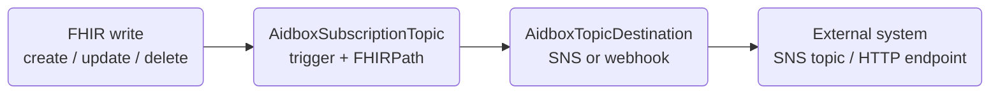

# Event Notifications

Payerbox can push FHIR resource events to external systems as they happen — for example, notifying a downstream system the moment a prior-authorization decision is recorded. This is built on Aidbox **topic-based subscriptions** and is configured entirely through FHIR resources.

This page is an operator how-to: how to define what to notify on, where to send it, and how to keep that configuration healthy.

## How it works

Two resources work together:

| Resource | Role |
|---|---|
| `AidboxSubscriptionTopic` | The trigger — which resource type, an optional FHIRPath criterion, and which interactions (create / update / delete) fire it. |
| `AidboxTopicDestination` | The sink — where matching events go. Its `kind` selects the transport (AWS SNS or HTTP webhook); `content` controls the payload shape. |

When a CRUD operation matches a topic's trigger, the engine writes one event per bound destination. Senders drain those events asynchronously, so a slow or unavailable subscriber never blocks the originating FHIR write.



### Delivery guarantees

Two delivery modes are available, selected by the destination `kind`:

- **At-least-once** — events are persisted to a database queue and retried until acknowledged. A subscriber may see the same event more than once, so handlers must be idempotent. Use this for anything where a missed notification matters (claim and decision notifications).
- **Best-effort** — fire-and-forget. Lower latency, no retry. Use only where an occasional drop is acceptable.

## Destination kinds

| `kind` | Transport | Profile (`meta.profile`) |
|---|---|---|
| `webhook-at-least-once` | HTTP POST to an endpoint | `http://aidbox.app/StructureDefinition/aidboxtopicdestination-webhook-at-least-once` |
| `aws-sns-at-least-once` | AWS SNS, queued + retried | `http://aidbox.app/StructureDefinition/aidboxtopicdestination-aws-sns-at-least-once` |
| `aws-sns-best-effort` | AWS SNS, fire-and-forget | `http://aidbox.app/StructureDefinition/aidboxtopicdestination-aws-sns-best-effort` |
| `custom-aws-sns-at-least-once` | AWS SNS, queued + retried, with reference enrichment | `http://health-samurai.io/fhir/core/StructureDefinition/aidboxtopicdestination-customAWSSNSAtLeastOnceProfile` |
| `custom-aws-sns-best-effort` | AWS SNS, fire-and-forget, with reference enrichment | `http://health-samurai.io/fhir/core/StructureDefinition/aidboxtopicdestination-customAWSSNSBestEffortProfile` |

The `custom-aws-sns-*` kinds are a Payerbox extension of the AWS SNS senders. When the `aidboxUrl` and `aidboxAuth` parameters are set, the sender resolves the triggering resource's references and ships an enriched payload instead of the bare resource; without those parameters they behave exactly like the plain `aws-sns-*` kinds.

The `webhook-at-least-once` kind and the plain `aws-sns-*` kinds are shipped by Aidbox and are accepted out of the box. The `custom-aws-sns-*` kinds use Payerbox-specific profiles that must be whitelisted before use — see Step 1 below.

## Configure a notification



### Whitelist the destination profile (custom SNS kinds only)

`AidboxTopicDestination` is constrained by an `allow-destinations` rule that lists the accepted `meta.profile` URLs. Built-in kinds (`webhook-at-least-once`, `aws-sns-*`) are already on this list. The Payerbox `custom-aws-sns-*` profiles are not, so they must be added **before** any destination that uses them is created — otherwise the destination is rejected at creation.

Patch the constraint to include the custom profile URLs:


```json
{
  "resourceType": "Parameters",
  "parameter": [
    {
      "name": "operation",
      "part": [
        {"name": "type", "valueCode": "add"},
        {"name": "path", "valueString": "differential.element.where(id='AidboxTopicDestination.meta.profile').binding.extension.valueSet"},
        {"name": "value", "valueUri": "http://health-samurai.io/fhir/core/StructureDefinition/aidboxtopicdestination-customAWSSNSAtLeastOnceProfile"}
      ]
    }
  ]
}
```


```bash
curl -sS -u "$ROOT_CLIENT" \
  -H "Content-Type: application/json" \
  -X PATCH "$AIDBOX_URL/fhir/StructureDefinition/AidboxTopicDestination" \
  -d @patch-allow-destinations.json
```

Repeat with the `customAWSSNSBestEffortProfile` URL if you use the best-effort variant. The list is additive — each PATCH appends one profile.



### Define the subscription topic

Declare what to notify on. The `trigger.fhirPathCriteria` narrows the firing condition; omit it to fire on every interaction of the resource type.


```json
{
  "resourceType": "AidboxSubscriptionTopic",
  "id": "pas-claimresponse-status",
  "url": "http://prior-auth.example.org/SubscriptionTopic/pas-claimresponse-status",
  "status": "active",
  "description": "Notify when PAS ClaimResponses are created or updated",
  "trigger": [
    {"resource": "ClaimResponse", "fhirPathCriteria": "use = 'preauthorization'"}
  ]
}
```


```bash
curl -sS -u "$ROOT_CLIENT" \
  -H "Content-Type: application/json" \
  -X PUT "$AIDBOX_URL/AidboxSubscriptionTopic/pas-claimresponse-status" \
  -d @subscription-topic.json
```



### Create the topic destination

Bind a destination to the topic's `url`. Pick the tab that matches your transport.




```json
{
  "resourceType": "AidboxTopicDestination",
  "id": "pas-claimresponse-sns",
  "kind": "custom-aws-sns-at-least-once",
  "meta": {
    "profile": ["http://health-samurai.io/fhir/core/StructureDefinition/aidboxtopicdestination-customAWSSNSAtLeastOnceProfile"]
  },
  "status": "active",
  "topic": "http://prior-auth.example.org/SubscriptionTopic/pas-claimresponse-status",
  "parameter": [
    {"name": "topicArn", "valueString": "arn:aws:sns:us-east-1:123456789012:pas-claimresponse"},
    {"name": "region", "valueString": "us-east-1"},
    {"name": "batchSize", "valueInteger": 1}
  ],
  "content": "full-resource"
}
```


SNS parameters:

| Parameter | Required | Notes |
|---|---|---|
| `topicArn` | Yes | Target SNS topic ARN. For a FIFO topic (ARN ends in `.fifo`), also set `messageGroupId`. |
| `region` | Yes | AWS region, e.g. `us-east-1`. |
| `accessKeyId` / `secretAccessKey` | No | Explicit credentials. If omitted, the default AWS credential chain is used (IAM role, environment, etc.). `secretAccessKey` is required when `accessKeyId` is set. |
| `endpointOverride` | No | Alternate SNS endpoint URL — used for local testing against an SNS emulator. |
| `messageGroupId` | FIFO only | Required when the topic ARN ends in `.fifo`. |
| `batchSize` | No | At-least-once only; 1–10. Number of events published per batch. |
| `aidboxUrl` / `aidboxAuth` | No | `custom-aws-sns-*` kinds only. Set both to enable reference enrichment; `aidboxAuth` is `username:password` for Basic auth. |

Prefer the default credential chain (IAM role) in production and avoid putting long-lived `secretAccessKey` values in the destination resource.




```json
{
  "resourceType": "AidboxTopicDestination",
  "id": "pas-claimresponse-webhook",
  "kind": "webhook-at-least-once",
  "meta": {
    "profile": ["http://aidbox.app/StructureDefinition/aidboxtopicdestination-webhook-at-least-once"]
  },
  "status": "active",
  "topic": "http://prior-auth.example.org/SubscriptionTopic/pas-claimresponse-status",
  "parameter": [
    {"name": "endpoint", "valueUrl": "https://downstream.example.org/webhooks/claimresponse"},
    {"name": "timeout", "valueUnsignedInt": 5000}
  ],
  "content": "full-resource"
}
```


Webhook parameters: `endpoint` (target URL, required) and `timeout` (per-delivery timeout in milliseconds). If the endpoint requires Basic auth, configure the corresponding Aidbox client with `grant_types: ["basic"]`.



```bash
curl -sS -u "$ROOT_CLIENT" \
  -H "Content-Type: application/json" \
  -X PUT "$AIDBOX_URL/AidboxTopicDestination/pas-claimresponse-sns" \
  -d @topic-destination-sns.json
```

`content: "full-resource"` ships the complete triggering resource in the notification. With a `custom-aws-sns-*` kind and `aidboxUrl`/`aidboxAuth` set, the payload additionally carries the resolved referenced resources.



### Verify

Trigger a matching write and confirm delivery downstream — for SNS, watch the topic's `NumberOfMessagesPublished` metric; for a webhook, check the receiver's logs. Do not rely on the internal event queue to confirm activity: the at-least-once queue is drained and the row deleted on successful delivery, so a healthy pipeline shows an empty queue within seconds.



## Provisioning at deploy time

In production these resources are typically created from an init-bundle rather than by hand, with environment-variable substitution for environment-specific values (topic ARN, region, credentials). Two ordering rules apply:

- The `allow-destinations` whitelist PATCH must come **before** any destination that uses a custom profile.
- A subscription topic should exist before the destinations that reference its `url`.

## Updating a destination

`AidboxTopicDestination` resources are **immutable** — Aidbox rejects `PUT` and `PATCH` on an existing destination. To change one (a new ARN, a different endpoint), **delete and re-create** it:

```bash
curl -sS -u "$ROOT_CLIENT" -X DELETE "$AIDBOX_URL/AidboxTopicDestination/pas-claimresponse-sns"
# then re-create with the new configuration (Step 3)
```

Re-creation is also what registers the destination with the in-memory delivery engine. A destination that exists in the database but was never created against a running engine (for example, an init-bundle entry that was a no-op because the resource already existed) will not deliver events. If a topic stops firing after a restart, delete and re-create the destination to force re-registration.

## Gotchas

- **Handlers must be idempotent.** At-least-once delivery can repeat an event. Deduplicate on the resource id and version, or guard with your own idempotency key.
- **Updates re-fire.** The engine fires on every interaction matching the criterion, including writes your own subscriber makes back into Aidbox. Avoid feedback loops when subscribing to a resource your downstream also updates.
- **Stale configuration does not self-correct.** Because destinations are immutable and init-bundles commonly create them only when absent, a wrong value set at first boot persists silently. Re-create the destination to fix it.

## Current limitations

- Destinations cannot be edited in place — every change is delete-and-re-create.
- There is no built-in dead-letter queue; an at-least-once event retries until delivered.
- Reference enrichment is available only on the `custom-aws-sns-*` kinds, not on webhooks.

## Related

- [Observability](observability.md) — metrics and audit logs for a running deployment
- [Architecture](../architecture.md) — where notifications fit in the component view
- [PAS](../../prior-auth/pas.md) — the prior-authorization flow that drives most notifications
