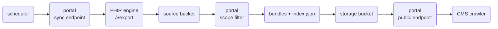

# MPF Pipeline

An optional module of the [FHIR App Portal](../fhir-app-portal/README.md), built into its [image](https://hub.docker.com/r/healthsamurai/fhir-app-portal) and enabled with `MPF_ENABLED=true`. It builds a CMS Plan-Net provider directory and publishes it as static FHIR `Bundle` files for the CMS [Medicare Plan Finder](https://www.medicare.gov/plan-compare/) (MPF) crawler.

Data flow:



All bucket access goes through Aidbox-signed URLs, so neither bucket needs to be public. The pipeline is triggered over HTTP, typically by a daily Kubernetes CronJob. A production-scale run takes upwards of half an hour. Endpoint details live in the [API reference](../api-reference/operations/mpf-pipeline-api.md).

## Prerequisites

- Aidbox access (Payerbox's FHIR engine).
- Two buckets: a **source bucket** for `$export` output and a **storage bucket** for the final files.
- Aidbox connected to both buckets. All bucket access goes through it. GCP and Azure use workload identity, AWS an `AwsAccount` resource. [File storage](https://www.health-samurai.io/docs/aidbox/file-storage) in the Aidbox docs covers the setups and IAM roles. [Step 4](#verify-bucket-signing) verifies the setup.


Every run adds a new folder to the source bucket. Set a lifecycle rule to expire old ones, keeping a few days for `folder` re-bundling. The storage bucket holds only the latest set.


## Set up




### Create the sync client

The pipeline authenticates to Aidbox as its own client. `PUT` this (and [step 2](#create-the-access-policy)'s policy) with admin credentials. The secret reappears in [step 3](#configure-the-environment).


```json
{
  "resourceType": "Client",
  "id": "mpf-sync",
  "secret": "<secret>",
  "grant_types": ["client_credentials"],
  "auth": { "client_credentials": { "access_token_expiration": 3600 } }
}
```





### Create the access policy

Least privilege: only the calls the portal makes.


```json
{
  "resourceType": "AccessPolicy",
  "id": "mpf-sync-policy",
  "engine": "matcho",
  "matcho": {
    "$one-of": [
      { "client": { "id": "mpf-sync" }, "request-method": "get",    "uri": "#^/fhir/\\$export(\\?|$)" },
      { "client": { "id": "mpf-sync" }, "request-method": "get",    "uri": "#^/fhir/\\$export-status/" },
      { "client": { "id": "mpf-sync" }, "request-method": "put",    "uri": "#^/Notification/" },
      { "client": { "id": "mpf-sync" }, "request-method": "post",   "uri": "#^/Notification/[^/]+/\\$send$" },
      { "client": { "id": "mpf-sync" }, "request-method": "post",   "uri": "#^/gcp/workload-identity/storage/" },
      { "client": { "id": "mpf-sync" }, "request-method": "get",    "uri": "#^/gcp/workload-identity/storage/" },
      { "client": { "id": "mpf-sync" }, "request-method": "delete", "uri": "#^/gcp/workload-identity/storage/" },
      { "client": { "id": "mpf-sync" }, "request-method": "post",   "uri": "#^/aws/storage/" },
      { "client": { "id": "mpf-sync" }, "request-method": "get",    "uri": "#^/aws/storage/" },
      { "client": { "id": "mpf-sync" }, "request-method": "delete", "uri": "#^/aws/storage/" },
      { "client": { "id": "mpf-sync" }, "request-method": "post",   "uri": "#^/azure/workload-identity/storage/" },
      { "client": { "id": "mpf-sync" }, "request-method": "get",    "uri": "#^/azure/workload-identity/storage/" },
      { "client": { "id": "mpf-sync" }, "request-method": "delete", "uri": "#^/azure/workload-identity/storage/" }
    ]
  }
}
```





### Configure the environment

On **Aidbox**, point `$export` at the source bucket:

| Variable | Description |
|---|---|
| `BOX_FHIR_BULK_STORAGE_PROVIDER` (required) | `gcp`, `aws`, or `azure`. Lets `$export` write to object storage. |
| `BOX_FHIR_BULK_STORAGE_GCP_BUCKET` (required) | The source bucket (setting name is provider-specific, GCP shown). |

On the **portal**:

| Variable | Description |
|---|---|
| `MPF_ENABLED` (required) | `true` to turn the module on. |
| `MPF_EXPORT_CLIENT_ID`, `MPF_EXPORT_CLIENT_SECRET` (required) | `mpf-sync` and the secret from [step 1](#create-the-sync-client). |
| `MPF_STORAGE_PROVIDER` (required) | Same provider as Aidbox's bulk storage. |
| `MPF_STORAGE_BUCKET` (required) | The bucket the bundles and `index.json` are published to. |
| `MPF_PUBLIC_BASE_URL` (required) | Prefix for the bundle links in `index.json`: the portal's public endpoint (`https://<portal>/mpf-provider-directory`) or a public bucket. |
| `MPF_FULL_URL_BASE` (required) | FHIR base URL for bundle entries' `fullUrl`, e.g. `https://fhir.<payer-domain>/fhir`. |
| `MPF_TRIGGER_CLIENT_IDS` (required) | Clients allowed to trigger runs. Set `admin-api,mpf-sync` (the default lacks `mpf-sync`). |
| `MPF_BUCKET_PREFIX` | Source bucket root URL. Only `folder` refresh uses it. |
| `MPF_ALERT_EMAIL_TO` | Failure-alert recipients via Aidbox `Notification` (needs its email provider configured). Unset: log-only. |
| `MPF_STORAGE_ACCOUNT_ID` | On AWS: the `AwsAccount` resource id. On Azure: the storage account name. Not used on GCP. |
| `MPF_BUNDLE_SIZE` | Max entries per bundle. Default `1000`. |
| `MPF_MAX_BUNDLE_BYTES` | Max bytes per bundle before rolling to a new file. Default 250 MB. |
| `MPF_OUTPUT_DIR` | Local directory where bundles are staged. Default `./mpf-output`. |

Resource types, profile filters, scope IDs, and the default contract are fixed in the portal image. Changing them is a portal release (coordinate with Health Samurai), or use the [Custom export flow](#custom-export-flow).




### Verify bucket signing

Prove the signing chain from [Prerequisites](#prerequisites) with one object before running the pipeline:


```bash
# get a token
TOKEN=$(curl -s -X POST https://<aidbox>/auth/token \
  -H 'Content-Type: application/json' \
  -d '{"grant_type":"client_credentials","client_id":"mpf-sync","client_secret":"<secret>"}' \
  | jq -r .access_token)

# get a presigned upload URL
URL=$(curl -s -X POST https://<aidbox>/gcp/workload-identity/storage/<storage bucket> \
  -H "Authorization: Bearer $TOKEN" -H 'Content-Type: application/json' \
  -d '{"filename":"_probe.json"}' | jq -r .url)

# put data through it
curl -i -X PUT "$URL" \
  -H 'Content-Type: application/json' -d '{"probe":true}'
```


On AWS or Azure, the endpoint prefix is `/aws/storage/<account>/` or `/azure/workload-identity/storage/<account>/`.




### Run and verify

Trigger a sync as `mpf-sync` (listed in `MPF_TRIGGER_CLIENT_IDS`, [step 3](#configure-the-environment)):


```bash
TOKEN=$(curl -s -X POST https://<aidbox>/auth/token \
  -H 'Content-Type: application/json' \
  -d '{"grant_type":"client_credentials","client_id":"mpf-sync","client_secret":"<secret>"}' \
  | jq -r .access_token)

curl -X POST https://<portal>/admin/mpf/sync \
  -H "Authorization: Bearer $TOKEN" \
  -H 'Content-Type: application/json' \
  -d '{"contract":"H1234"}'
```


The endpoint is asynchronous and the pipeline runs in the background. Verify, in order:

1. Pod logs: `[mpf:sync] export kicked off`, later `export completed`.
2. Source bucket: a new folder of NDJSON files.
3. Logs: `publishing via signed URLs`. A `403` here means the policy is missing the signing branches from [step 2](#create-the-access-policy).
4. Logs: `run completed` with `uploaded=true`. The storage bucket holds bundles and `index.json`.
5. The public endpoint (the URL the crawler will go to) works: `GET https://<portal>/mpf-provider-directory/H1234/2026/index.json`.




## Custom export flow

The prebuilt pipeline covers the whole path out of the box. A custom flow (different scope, resource types, or post-processing) can reuse the same `$export`, client, policy, and storage setup. A runnable example lives in the [Aidbox examples repository](https://github.com/Aidbox/examples).

## Related


[mpf-pipeline-api.md](../api-reference/operations/mpf-pipeline-api.md)



[provider-directory.md](../interop-apis/provider-directory.md)



[cms-9115.md](../compliance/cms-9115.md)

